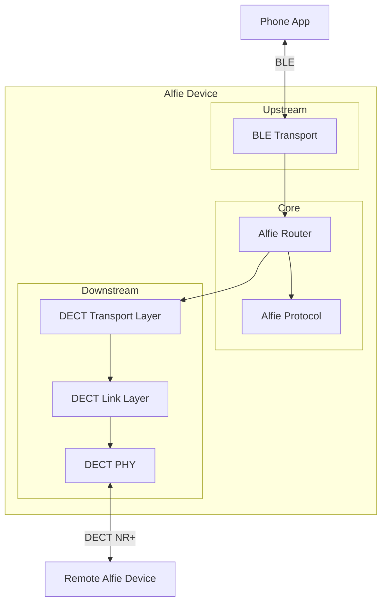
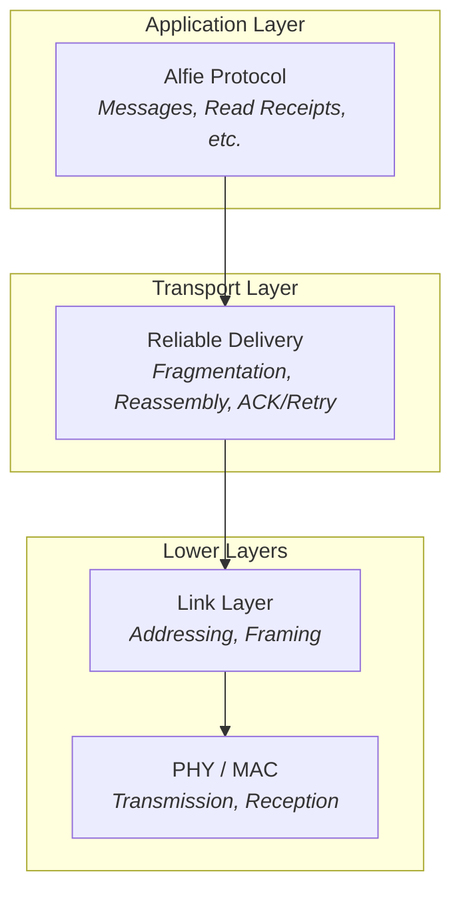

# Project Alfie (Part 1): Introducing Alfie and DECT NR+

## Inspiration

Born in Buffalo, NY, cold and snow never bothered me.  We could get 6-8 inches of snow overnight and barely bat an eye.  In fact, I love snow!  Living in Nashville, TN (at least at the time of writing this), I find myself feeling extra sad in the winter.  Not because the weather is dreary, damp, and gray, but because there's pretty much no snow.

However, the end of January 2026 brought Icemageddon to Central Tennessee, which brought the area to a near standstill.  Branches were falling down, taking out power to 92% of Davidson county.  Some people were without electricity and heat for nearly two weeks.

A coworker of mine ended up with a large tree limb through the roof and standing vertically in his living room (He and his family are all safe and sound now).  Not only did he have a brand new shrine to Arbor Day inside his house, but the storm had taken out cellphone service in his area.

When you think about all the infrastructure that we take for granted, it's easy to gloss over the sheer complexity of it all as well as how fragile it can be.  As is with most things we take for granted, it's easy to forget how much we rely on that infrastructure.

At the same time as this all went down, I was reading the novel Cyberstorm, by Matthew Mather, in which a series of events led to an extended blackout in New York City.  All the utilities are out, cell and internet is completely down, and chaos ensues.

However, a character in the book was able to create a mesh network, enabling communication throughout the city.

Icemageddon, Cyberstorm, and chatting with my boss about DECT NR+ got the gears in my head spinning and armed with some Nordic devkits and some elbow grease, Project Alfie began.

## The Goal of this Series & A Disclaimer

This series is not a tutorial.  This is a pure brain dump of my thought process and me sharing something I've been hyperfixed on for a bit.  It is also an outlet because my wife didn't want to hear me talk about DECT NR+ anymore.

I am most definitely not a subject matter expert on DECT NR+.  I'd be hesitant to say I'm a subject matter novice.  This is me taking an idea, and using it as an excuse to use a cool new technology incorrectly.

With all that being said, let me introduce you to Alfie!

_Alfie Logo_

## What is Alfie (Why is it Called Alfie?)

The TL;DR is that I imagined a Magsafe accessory with BLE and a DECT radio that allowed for "text messaging" with DECT as the transport medium.

The specification does call out mesh capabilities, much like LoRa, but with significantly higher bandwidth and much lower latencies.  This is not a deep dive into DECT NR+ as the spec is incredibly dense.  One could argue the spec describes a system that isn't well suited for this mode of communication, but it still provides a good challenge.

So Alfie is the name of this ideal device, as well as the name of the protocol that I defined for this project.

Why "Alfie?"

I'm not good at naming things.  I've got two dogs, one is named Alfie.  I thought Alfie was a fun name and began thinking of how it could be used as an acronym.  I landed on "A Little Frequency is Enough."  My other dog, Darla, will get her namesake later in the series.

_Alfie. The dog._

## High-Level Alfie Architecture

At its core, the Alfie hardware device and firmware is simply a bridge between DECT NR+ and some other transport layer.  In this iteration, DECT NR+ is the backhaul for the "network" with BLE as the transport for a single "node" on the network.  I refer to the DECT side as the downstream and the BLE side as the upstream.

The system was architected in such a way that there could be multiple "upstreams" and multiple "downstreams".  For instance, WiFi could be used as an "upstream" transport instead of/in addition to BLE.

### The Hardware

I started out with a Nordic Thingy:91X.  This is a really cool development platform powered by an nRF9151 (LTE, NTN, GNSS, and DECT connectivity) as well as an nRF5340 (BLE).  It also comes with a PMIC, LiPO battery, and a couple other features.

### Communication Stack

The architecture is not much different than any connected device.  There is an application layer, a transport layer, and a set of lower layers that handle the physical communication.

Working backwards, the Alfie protocol is the application layer.  It defines the format of text messages as well as future functionality like read receipts, typing indicators, etc.  This layer is agnostic of the transport and medium beneath it.

Below that is the transport layer.  This is responsible for the reliable delivery of application layer data between two devices.  It also handles breaking and reassembling large messages into smaller packets that fit within the MTU of the underlying medium.

Last, there are the lower layers — the PHY, MAC, and link layer.  These handle device addressing, identification, and the actual transmission and reception of data over the air.  We'll do a deeper dive into the implementation of these layers on the DECT side in part 2 of this series.

## What's Next?

There is a lot that can be talked about with this project, especially on the DECT NR+ side.  It's an iterative process and a journey to play around with DECT.  There will be plenty of things that are "incorrect" and not optimal, but all things that will be iterated on.

Part 2 focuses on interacting with the DECT PHY on the nRF9151 and implementing a super rudimentary link and MAC layer.
