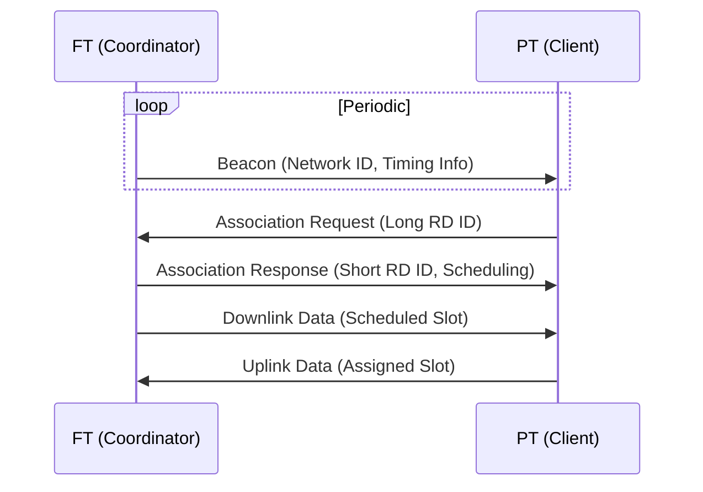
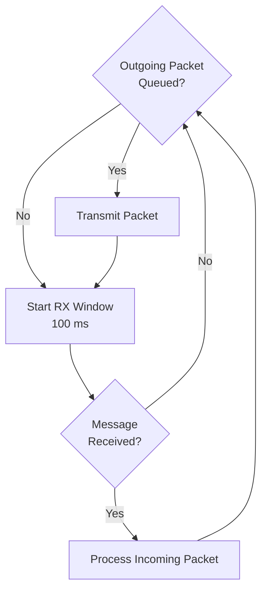
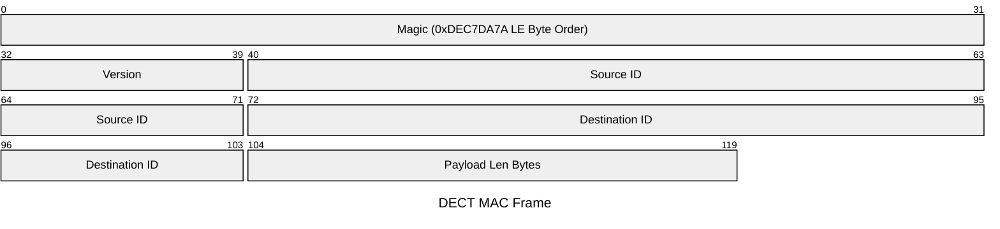

# Alfie Project (Part 2): A DECT PHY and a Non-conforming Link & MAC Layer

## Overview

Before you can run, you need to walk.  In our case, we're just going to focus on crawling, and we're going to be happy, dammit!

Part 1 of this series provided a bird's-eye view of Alfie's architecture: the Alfie protocol at the top, a transport layer in the middle handling fragmentation, reassembly, and retries, and what I'm calling the link layer at the bottom.

## Alfie (and Shrek) is Like an Onion

If you are familiar with the Open Systems Interconnection (OSI) model, you've probably heard of Layer 1 through Layer 7.  At the bottom, Layer 1 is the physical layer — it defines how raw data is transmitted over a physical medium, like an Ethernet cable, fiber line, or radio.  One layer up, Layer 2 is the link layer, which handles device addressing, frame definition, and controls interaction with the physical layer.  At the top, Layer 7 is the application layer — think HTTP, FTP, SSH, etc.  That's where the Alfie protocol sits.

There's a lot in between, but we don't need all seven layers for our mental model.

Consider the image below:


_(By DnaX - Own work; Original:File:Application Layer.png, CC BY-SA 4.0, https://commons.wikimedia.org/w/index.php?curid=182053722)_

We can simplify things down to the TCP/IP model: a network access layer at the bottom, a transport layer in the middle, and the application layer at the top.  We'll skip the internet layer for now.

Our focus today is the network access layer.

## What's Available

For simplicity's sake, I'm treating the link layer and MAC layer as synonymous and may refer to it as either.

At the time of writing, Nordic provides the PHY layer via proprietary modem firmware as well as a very basic MAC layer based on the official ETSI specification.

Wirepas has a commercial implementation of the link and MAC layers.

We don't need any of that.  We're just doing simple point-to-point communication, so our solution is going to be much simpler than either of these implementations and far from spec-compliant.

Our goal at the end of part two is to have two nRF9151s talk to each other over DECT NR+ and our own link layer.

## High-Level Approach

Our link layer has a few jobs: interface with the PHY, coordinate when a device can receive and transmit, frame outgoing data, and provide an addressing scheme so two devices can talk to each other.

### Timing, Association, and Orchestration

Without getting too much in the weeds, the specification prescribes a hub and spoke topology.  One device takes the role of a Fixed Termination (FT) — think of it as the coordinator — and the other is a Portable Termination (PT).

At the PHY level, DECT is half-duplex, meaning it can either transmit or receive, but not both at the same time.  However, a full-duplex experience can be achieved using time-division duplexing (TDD), where the device rapidly alternates between transmit and receive time slots.

The FT periodically beacons out saying "Hey, I'm an FT.  Reach out to me for a timeslot!"  A PT hears this beacon and requests to be associated with the FT.  The FT, if accepting the association, responds with timing information — things like when the PT should wake up and listen for incoming messages, and when it is allowed to transmit back to the FT.

You can think of the FT as a WiFi access point and a PT as a laptop connecting to that WiFi access point.



On the surface, this doesn't seem like it meshes well (no pun intended) with the desired use case of texting, which is inherently non-deterministic and asynchronous.  This is a topic we'll dive into much later as we discuss optimizing for reliability and battery life, and how we can actually fit our use case into this model.

However, we need to be able to crawl before we walk and walk before we can run.  So for now, we're going to ignore the FT/PT designation, and our timing scheme is greatly simplified.

This is where clean layer separation pays off.  The higher layers are completely agnostic to the implementation details of the layers below them.  As long as there is a well-defined interface between levels, we can theoretically change the entire link layer implementation and nothing above it needs to change.  The implementation may affect performance, but the application layer really only cares about sending messages to a specific user and receiving messages — and that interface can be the same regardless of the transport medium.

So what does our minimal implementation look like in terms of timing and orchestration?  Well first, there's no concept of an FT or PT.  This is purely peer-to-peer.

In terms of timing, we maximize our listening window.  Latency is not really a big concern with texting as it would be for real-time voice or video chat.  So each iteration of the loop, we first check if any outgoing packets are queued up.  If there is one, we transmit a packet.  Then we tell the PHY to listen for any incoming messages for up to 100 milliseconds.  If a message comes in during that window, we process that incoming packet, then start the loop over.



There are some obvious implications of this approach.  There's an impact on battery life, increased potential of collisions with multiple devices trying to transmit at the same time, and potential for missing incoming packets due to a lack of synchronization of this RX window.  For our proof of concept, these are fine and things that we can address later on.

### Addressing

The MAC layer is also responsible for implementing a method for addressing individual nodes.  Transport media like BLE, WiFi, and Ethernet have a unique MAC address — a 48-bit number that is unique to that device.

For DECT, there are actually a couple different IDs in play:

1. A 32-bit network ID
2. A 32-bit Long Radio Device ID
3. A 16-bit Short Radio Device ID

The network ID is a way to group a collection of nodes together.  Think of it like a WiFi SSID — it identifies which network a device belongs to.

The Long Radio Device ID is a unique 32-bit number that identifies a specific node.  This is very similar to the 48-bit MAC address for BLE or WiFi.  This is a value that would most commonly be assigned during provisioning or manufacturing of the device.

The Short Radio Device ID is an ID that the FT assigns a PT during association.  After association, the FT uses the short ID to talk to the PT, and vice versa.  This reduces the amount of "air time" which frees up bandwidth and helps achieve lower latency and better battery life.  This short ID is actually what gets written to the PHY header when a transmission goes out.

For our first pass, we're going to stick with a fixed network ID.  This is not a commercial product, and the user base of this product at the time of writing is one person (me).  Only the lower 8 bits of the network ID are actually written to the PHY header.

For each node's 32-bit long ID, we simply take the lower 32 bits of the nRF9151's unique hardware ID that is assigned during manufacturing.  We also use this long ID for addressing at the application layer as well as in the MAC framing, but we'll get to that later.

And for the short ID, we just take the lower 16 bits of the long ID to pass into the PHY header.

### Framing

The final responsibility our MAC layer has is framing.  Practically speaking, what that looks like is almost entirely up to us, and I'm going to keep up with my pragmatic and "keep it simple, stupid" (KISS) methodology.

In terms of the information we need in the frame, we really only need the ID of the sender (`src_id`), the destination for our frame (`dst_id`), and the payload size in bytes.

That being said, we'll add a bit of pepper and spice to allow for some future-proofing and defensive programming by adding a 32-bit magic value and an 8-bit version field in case we need to extend the frame down the road.

The `src_id` and `dst_id` are simply the 32-bit long ID.

So the frame header looks something like this:



Note, all fields in the frame header (and upper layers mentioned later in the series) are little-endian byte order.  So the magic value called out in the diagram above is actually 0x7ADAC7DE if looking at the actual bytestream going out over the air.

### MTU Size

A very quick mention of MTU sizes.  Much later in this series, when we start improving our MAC layer, there will be a much more in-depth discussion about slots and subslots.  The cliff notes version of the cliff notes version is that a DECT transmission is broken up into 24 slots, which can then be broken up into subslots.  There's a lot to unpack there with PHY parameters like the Modulation and Coding Scheme (MCS) and the packet length.  For now, all we need to know is we're choosing fixed values for the MCS and packet length parameters, and that gets us an MTU size of 37 bytes.

This MTU size includes our frame header, which is 15 bytes.  That leaves 22 bytes for the frame payload.

This MTU size is "use it or lose it", meaning 37 bytes will be sent over the air, regardless of how many bytes are actually in your frame.  If your total frame size is 30 bytes, the rest of that frame will be padding.

## Implementation

"Shut up and show me the code, already."

Fine... but only the abridged version...

### Frame Definition

I typically like to define all my types and constants first, and luckily, that's a pretty quick task:

```c
#define DECT_LINK_LAYER_MTU_SIZE_BYTES (37U)
#define DECT_LINK_LAYER_MAX_PAYLOAD_SIZE_BYTES (DECT_LINK_LAYER_MTU_SIZE_BYTES - sizeof(dect_link_layer_frame_header_t))

#define DECT_LINK_LAYER_FRAME_MAGIC (0xDEC7DA7AU)

typedef struct dect_link_layer_frame_header_t {
  uint32_t magic;
  uint8_t version;
  uint32_t src_id;
  uint32_t dst_id;
  uint16_t payload_size_bytes;
} __attribute__((__packed__)) dect_link_layer_frame_header_t;

typedef struct dect_link_layer_frame_t {
  dect_link_layer_frame_header_t header;
  uint8_t payload[DECT_LINK_LAYER_MAX_PAYLOAD_SIZE_BYTES];
} __attribute__((__packed__)) dect_link_layer_frame_t;
```

### API

One thing I love is a well-defined API, and taking the time to define a well-thought-out one is never wasted time, in my opinion.  Implementation details are always in flux, but a clean API with clear abstractions and readable interfaces makes everything easier in the long run.  Coworkers, clients, and future heirs tasked with maintaining your code will thank you.

Stepping off my soapbox, let's think about what the interaction with an upper layer will look like.

Right now, the transport layer only needs two things from the MAC layer:

1. A means of queuing up data to write out over the air
2. A means to get incoming data sent to us

For outbound data, the MAC layer needs:

1. The destination address
2. The payload to be written
3. The size of the payload

For incoming data, the transport layer needs:

1. The source address
2. The received payload
3. The size of the payload

That gives us the following API:

```c
typedef void (*dect_link_layer_rx_callback_t)(const uint32_t src_id, const void *buf, const size_t len_bytes);

int dect_link_layer_write(const uint32_t dst_id, const void *buf, const size_t len_bytes);

int dect_link_layer_register_rx_callback(dect_link_layer_rx_callback_t callback);
```

### Threading

We spin up a thread to handle coordinating with the PHY and data transfer.

```c
static void prv_thread(void *arg1, void *arg2, void *arg3) {
  while (true) {
    // Dequeues up to one queued tx frame and writes if one available
    prv_write_pending_tx_frame();
    
    prv_receive();
  }
}
```

### PHY Interaction

Our link layer is responsible for interacting with the PHY.  For this first pass, we really only care about initializing the PHY and kicking off read/write operations.

In our case, the initialization and setup for the PHY is static, so that portion is out of scope of this article.

For now, we'll just focus on dispatching read and write operations to the PHY.

A callback can be registered with the PHY library which has a series of events that call into this registered callback.  There are a couple events that we're concerned with at this stage:

1. `NRF_MODEM_DECT_PHY_EVT_COMPLETED` - Fired at the end of an operation, including failure
2. `NRF_MODEM_DECT_PHY_EVT_PDC` - Called when a data frame has been received by the modem

This event callback is called from the modem library's internal workqueue context.

Our main event handler callback looks like the following:

```c
static void prv_dect_phy_event_handler(const struct nrf_modem_dect_phy_event *event)
{
    switch (event->id) {
        ...
        case NRF_MODEM_DECT_PHY_EVT_COMPLETED:
            prv_on_phy_op_completed(&event->op_complete);
            break;
        case NRF_MODEM_DECT_PHY_EVT_PDC:
            prv_on_phy_pdc_event(&event->pdc);
            break;
        ...
    }
}
```

Our link thread is the only thread that kicks off operations, and only one operation can happen at a time.  The completed event is also common to both types of operations we would kick off, so we can actually deal with that completed event the exact same way.

```c
static struct {
  ...
  struct {
    struct k_sem op_complete;
    bool op_failed;
    int op_ret;
  } ops;

} prv_inst;

static void prv_on_phy_op_completed(const struct nrf_modem_dect_phy_op_complete_event *event)
{
    if (event->err) {
        prv_inst.ops.op_failed = true;
        prv_inst.ops.op_ret = event->err;
    }

    k_sem_give(&prv_inst.ops.op_complete);
}

```

### Write Path

For now, we're going to keep the write path and its contract very simple.  A TX queue is serviced by the link layer thread.

The write function is thread-safe and non-blocking.  If there's no space available in the TX queue, then the function returns immediately with an error code.

The return of that function only indicates success in queuing up the outbound data.  Right now, there's no callback provided by the link layer indicating the success or failure of transmitting the frame.

```c
static struct {
  struct k_msgq tx_queue;

} prv_inst;

int dect_link_layer_write(const uint32_t dst_id, const void *buf, const size_t len_bytes) {
  if (buf == NULL || len_bytes == 0 || len_bytes > DECT_LINK_LAYER_MAX_PAYLOAD_SIZE_BYTES) {
    return -EINVAL;
  }

  dect_link_layer_frame_t frame = {
    .header = {
      .magic = DECT_LINK_LAYER_FRAME_MAGIC,
      .version = 1,
      .src_id = device_id(),
      .dst_id = dst_id,
      .payload_size_bytes = len_bytes
    },
  };
  
  int ret = k_msgq_put(&prv_inst.tx_queue, &frame, K_NO_WAIT);

  if (ret != 0) {
    LOG_ERR("Failed to queue link TX frame: %d", ret);
  }
  
  return ret;
}
```

In the link layer thread, there's a little bit of DECT configuration that we'll ignore for right now.  Then we dispatch our frame to the modem and block until the operation is complete with the semaphore.

```c

static int prv_write_pending_tx_frame(void) {
  dect_link_layer_frame_t frame = {0};

  int ret = k_msgq_get(&prv_inst.tx_queue, &frame, K_NO_WAIT);

  if (ret != 0) {
    return ret;
  }

  k_sem_reset(&prv_inst.ops.op_complete);
  prv_inst.ops.op_ret = 0;
  prv_inst.ops.op_failed = false;

  struct phy_ctrl_field_common header = {
    ...
    .short_network_id = (CONFIG_NETWORK_ID & 0xFF),
    .transmitter_id_hi = (device_id() >> 8),
    .transmitter_id_lo = (device_id() & 0xFF),
  };

  struct nrf_modem_dect_phy_tx_params tx_op_params = {
    ... 
    // Handle fixed to 0 at the moment
    .handle = 0,
    .network_id = CONFIG_NETWORK_ID,
    .phy_header = (union nrf_modem_dect_phy_hdr *)&header,
    .data = (uint8_t *)&frame,
    .data_size = sizeof(dect_link_layer_frame_t),
  };
  
  ret = nrf_modem_dect_phy_tx(&tx_op_params);
  if (ret != 0) {
    LOG_ERR("Failed to dispatch frame to PHY: %d", ret);
    return ret;
  }

  k_sem_take(&prv_inst.ops.op_complete, K_FOREVER);

  if (prv_inst.ops.op_failed) {
    return prv_inst.ops.op_ret;
  }

  return 0;
}
```

### Reading

The reception side from the PHY is broken up into two different chunks.  The Physical Control Channel (PCC) and the Physical Data Channel (PDC).

The PCC contains information that a proper MAC layer would use to handle more complex routing and PHY control.  For now, we're going to ignore the PCC and revisit it when we start working on optimization and a more mature MAC layer.

The actual contents sent to a device live in the PDC.

There are a couple modes you can put the PHY into when reading.  A continuous listening mode, which results in the PDC event firing on every reception until the RX timeout expires.  Another is "single-shot", which listens up until the RX timeout or until a full transmission is received, then stops listening even before the RX window expires.

For now, we're going to use single-shot mode and an RX window of 100 ms.  As mentioned earlier, every iteration of the loop, we check if there's anything in our TX queue and send it out, then we kick off an RX operation until a message is received or the RX window expires.

The RX buffer is passed to the PDC callback, and we want to pass that buffer to the upper levels from the link layer thread, so we need a place to copy the RX buffer to as well as indicate to the link thread that a message has been received.

Since we only ever receive one RX frame per operation, a simple flag and shared buffer can be used between the PHY API and our link thread.  A queue or FIFO of net buffers would be more appropriate, but for this first pass, this is good enough.

```c
static struct {
  ...

  volatile bool rx_flag;
  dect_link_layer_frame_t rx_frame;
} prv_inst;

```

Inside the PDC callback is where we validate that the frame header is valid and check if the `dst_id` matches our device ID.  If everything checks out, we copy the RX buffer to our shared `rx_frame` and set the RX flag.  The "operation complete" event fires and unblocks the link thread.

```c
static void prv_on_phy_pdc_event(const struct nrf_modem_dect_phy_pdc_event *event)
{
    if (event->len < sizeof(dect_link_layer_frame_header_t) || event->len > sizeof(dect_link_layer_frame_t)) {
        LOG_WRN("Invalid link layer frame size.");
        return;
    }

    dect_link_layer_frame_t *frame = (dect_link_layer_frame_t *)event->data;
    if (frame->header.magic != DECT_LINK_LAYER_FRAME_MAGIC) {
        LOG_WRN("Invalid link layer magic.");
        return;
    }

    // Check if frame is for us
    if (frame->header.dst_id != device_id()) {
        return;
    }

    memcpy(&prv_inst.rx_frame, frame, event->len);
    prv_inst.rx_flag = true;
}
```

On the link layer thread side, we kick off the RX transaction, block on the semaphore, and if the flag is set, we call our registered RX callback to hand off the payload to the upper transport layer.

```c
static void prv_receive(void) {
  
  prv_inst.ops.op_ret = 0;
  prv_inst.ops.op_failed = false;

  prv_inst.rx_flag = false;

  struct nrf_modem_dect_phy_rx_params rx_op_params = {
    ...
    .network_id = CONFIG_NETWORK_ID,
    .mode = NRF_MODEM_DECT_PHY_RX_MODE_SINGLE_SHOT,
    .duration = DECT_LINK_LAYER_RX_WINDOW_MS * NRF_MODEM_DECT_MODEM_TIME_TICK_RATE_KHZ,
    .filter.short_network_id = CONFIG_NETWORK_ID & 0xff,
    .filter.is_short_network_id_used = 1,
    /* listen for everything (broadcast mode used) */
    .filter.receiver_identity = 0,
  };

  int ret = nrf_modem_dect_phy_rx(&rx_op_params);
  if (ret != 0) {
    LOG_ERR("Failed to kick off read operation: %d", ret);
    return;
  }

  k_sem_take(&prv_inst.ops.op_complete, K_FOREVER);

  if (prv_inst.ops.op_failed) {
    LOG_ERR("Receive operation failed: %d", prv_inst.ops.op_ret);
  }
}
```

## Demo Time!

Let's see our working link layer in action!

I have two Thingy91X devices flashed with our link layer firmware and a UART shell.

I've added a couple shell commands in the firmware.  One to print out the device ID and the other to write a payload with the link layer.  Any received messages are printed out over the console.


_Available DECT Link Layer Commands_

Running `dect_link_layer device_id` on both devices shows their 32-bit ID:


_DECT IDs of Both Devices_

From the shell on the left, we write a message with the device ID of the device on the right with a payload of "Hello, DECT!"  That message, along with the payload length and device ID of the sending node, appears on the right shell.


_Writing Link Layer Frame From Left Shell to Right_

We can reply back with "Hello, back!" from the right shell with the first device's ID.  You see the frame information along with the "Hello, back!" payload appearing on the left shell.


_Writing Link Layer Frame From Right Shell to Left_

## Conclusion

And with that, we're sending data between two devices over a DECT NR+ PHY!

Now there are clearly some limitations with only having a link layer.  The first one being we can only send a maximum of 22 bytes as a payload.  That's perfectly fine if your spouse is mad at you and only wants to respond with "k."  But there's usually more to be said.

We also have no way to know if the recipient has received our frame and no mechanisms in place for handling that scenario.

This is where the next layer in our DECT stack comes into play and is the topic of Part 3 of this series.

The firmware for this project can be found on [GitHub](https://github.com/evanstoddard/alfie_firmware).
