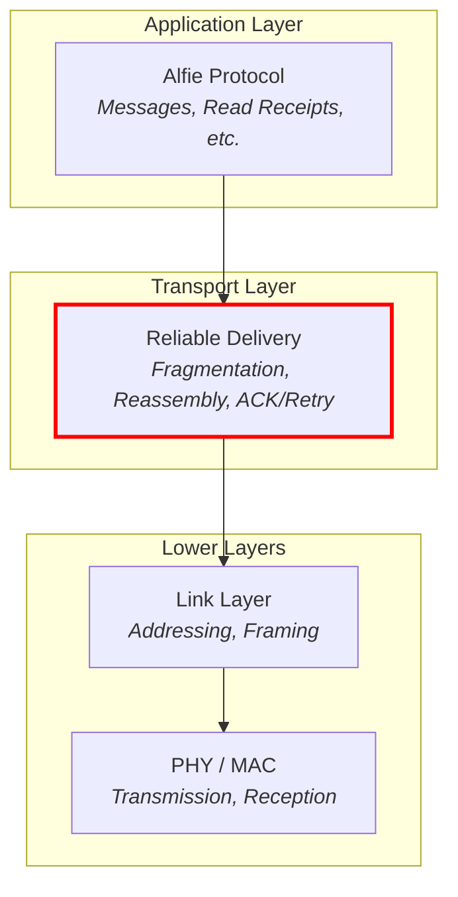
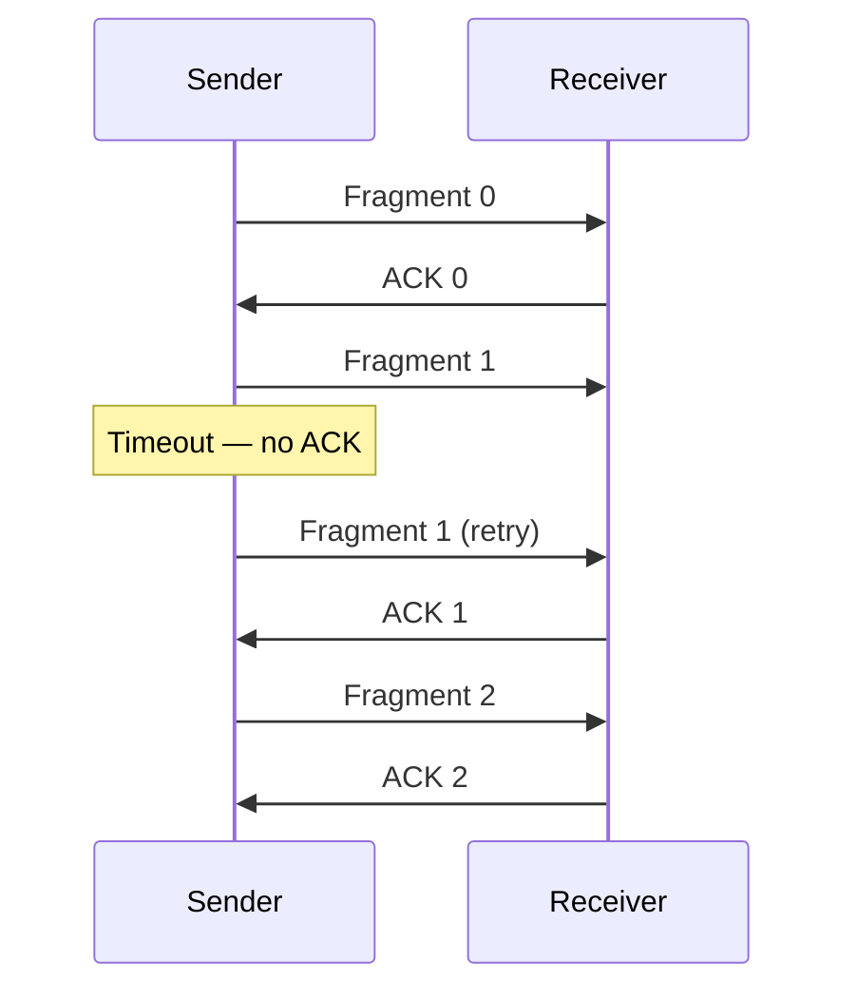
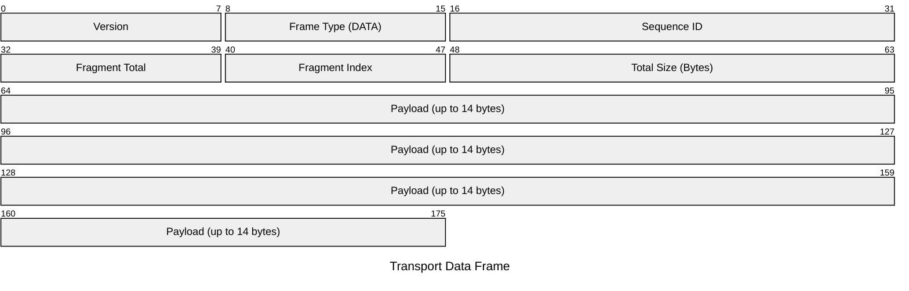
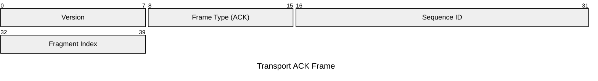
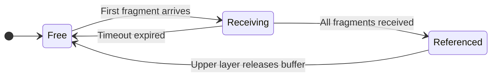

# Alfie Project (Part 3): Designing a Transport Layer

## Overview

In part 2 of this series, we implemented the link/MAC layer for Alfie. Its purpose was to interact with the PHY and provide a means of addressing individual devices.

At the end, we were able to have two devices talk to each other, but they could only send messages up to 22 bytes long and had no way of knowing if their message was received.

These are problems solved by the transport layer, which sits above the link layer.

## What is the Transport Layer

### Where It Fits

As a quick refresher, here's our simplified communication stack from Part 1:



The transport layer sits inbetween the upper application layer, and the lower link layer.  The application layer doesn't know or care about MTU sizes, fragmentation, or whether a message made it to the other side.  It just hands data down and trusts that the transport layer will figure it out.  Similarly, the link layer doesn't know or care about the contents of the payload it's sending. It just takes a chunk of bytes and sends it over the air.

The transport layer is the glue between those two worlds.

The application layer has a component called the Alfie router which handles routing and dispatching within the Alfie protocol.  It's mentioned a couple of times in this post, but we'll cover it in detail later in the series.

### What It Does

Our transport layer has two main responsibilities:

**Fragmentation and Reassembly**

Our link layer has an MTU of 37 bytes, and after the 15-byte link layer header, we're left with 22 bytes of payload.  That's enough for "Pick up milk" but not much else.  Any real message, especially once we add headers from higher layers, is going to blow through that maximum payload size.

This is where the transport layer comes in.

It's responsibility is to break up those larger messages into chunks that can fit in our link layer payload, and on the receiving end, reassemble those fragments into the original message.

**Reliable Delivery**

Our link layer is send-it-and-forget-it.  You hand it a frame, it sends it over the air, call it a day.  There's no indication of whether the other side actually received it.

The transport layer adds acknowledgement (ACK) to the mix.  When a device receives a fragment, it sends an ACK back to the sender.  If the sender doesn't receive an ACK within a timeout window, it retries.

### Our Approach: Stop-and-Wait ARQ

There are many strategies for implementing reliable delivery.  We're going with the simplest one: stop-and-wait ARQ (Automatic Repeat reQuest).

The process is pretty simple. The sender transmits a fragment, waits for an ACK, and on reception of that ACK, sends the next fragment.  Keep this going until all the fragments are sent out. If an ACK doesn't come back within a timeout, that fragment is resent.  And if we've sent out a fragment `n` number of times without an ACK, then, give up...




## Transport Frame Design

Just like the link layer has its own frame header, the transport layer needs one too.  Our transport header lives inside the link layer's 22-byte payload, so every byte we spend on the header is a byte we can't use for actual data.  Real estate is precious.

We need two frame types: a DATA frame for sending fragments of a message, and a DATA_ACK frame for acknowledging received fragments.

### DATA Frame

So what information do we actually need to include when sending a fragment?

- **Version** — Same idea as the link layer version field.  A little future-proofing in case we need to change the frame format later.
- **Frame type** — Tells the receiver whether this is a DATA frame or a DATA_ACK frame.
- **Sequence ID** — A randomly generated ID for each transaction.  This is how the receiver knows which fragments belong together.  If two messages are being sent around the same time, the sequence ID is what keeps their fragments from getting mixed up.
- **Fragment total** — The total number of fragments in this transaction.
- **Fragment index** — Which fragment this is, zero-indexed.
- **Total size (bytes)** — The total size of the reassembled message.  This lets the receiver allocate the right amount of space upfront and verify that the final reassembled result is the expected size.

That gives us the following 8-byte header, leaving 14 bytes per fragment for actual payload data:



### DATA_ACK Frame

The ACK frame is much simpler.  All it needs to do is tell the sender "I got fragment X of transaction Y":

- **Version** and **Frame type** — Same as the DATA frame, but the frame type indicates DATA_ACK.
- **Sequence ID** — Echoes back the sequence ID from the DATA frame being acknowledged.
- **Fragment index** — Echoes back the fragment index that was received.

That's just 5 bytes, and since an ACK carries no payload, that's the entire frame:



### The Math

With our 8-byte DATA frame header, we're left with 14 bytes of usable payload per fragment.  So a 100-byte message would require $\lceil 100 / 14 \rceil = 8$ fragments, each individually sent and acknowledged.

## The Transport Buffer

Before we get into the transport layer implementation, we need to talk about the transport buffer.  This is the workhorse behind reassembly and is its own standalone component, separate from any specific transport layer.

### Why It's Separate

Alfie has two transport paths — DECT on the downstream side and BLE on the upstream side.  Both need to fragment outgoing data and reassemble incoming fragments.  Fragmentation on the TX side is pretty straightforward — chop up the data, send each piece.  Reassembly, on the other hand, is a different beast.  You need to track partially received transactions, match incoming fragments to the right buffer, handle duplicates, detect timeouts, and manage buffer lifecycles.

I didn't want to write all of that twice.  So the transport buffer is a generic, reusable component that any transport can plug into.

### The Concept

At a high level, it's a pool of reassembly buffers.  Each buffer in the pool can handle one incoming transaction at a time — receiving fragments, stitching them together, and handing off the completed message.

Here are the key ideas:

**Buffer States**

Each buffer in the pool is in one of three states:

- **Free** — Available and waiting to be allocated for a new incoming transaction.
- **Receiving** — Actively collecting fragments for an in-progress transaction.
- **Referenced** — Reassembly is complete.  The buffer is being held by an upper layer (like the router) for processing.



**Fragment Matching**

When a fragment comes in, the pool needs to figure out which buffer it belongs to.  It does this by matching on the sequence ID, fragment total, and total size from the transport frame header.  If a match is found, the fragment gets written to that buffer.  If no match is found and the fragment is the first in a new transaction (fragment index 0), a new buffer is allocated from the pool.

**Timeouts**

What happens if a transaction starts but never finishes?  Maybe the sender lost power, or enough fragments were dropped that the retry limit was exceeded.  Without cleanup, that buffer would be stuck in the receiving state forever.

The pool handles this with a simple timeout.  Each buffer tracks when it last received a fragment.  If that timestamp is older than the configured timeout (10 seconds in our case), the buffer is reclaimed and returned to the free state the next time the pool looks for a buffer.

**Reference Counting**

Once reassembly is complete, the buffer might be passed through multiple layers — from the transport to the router to an endpoint.  Rather than copying the data at each handoff, we use reference counting.  Layers that need to hold onto the buffer increment the reference count, and decrement it when they're done.  When the count hits zero, the buffer goes back to the free state.

**Extensibility**

Different transports might need to match on additional criteria beyond sequence ID, fragment total, and total size.  For example, the DECT transport also needs to match on the source device ID, since multiple remote devices could theoretically send transactions with the same sequence ID.

The pool supports this through an optional callback that lets a transport define its own additional matching logic.  This keeps the core buffer code generic while allowing transport-specific behavior.

## Transport Layer API

I briefly mentioned this in Part 1 — the system was designed so that there could be multiple upstreams and downstreams.  The DECT transport layer (and the BLE transport layer) are both implementations of a generic transport interface called `alfie_transport_t`.  The router doesn't interact with DECT or BLE directly — it just talks to transports through this common API.

### The Interface

From the router's perspective, a transport really only needs to do two things:

1. **Write** — Send data to a destination device.  The router provides a destination ID, a pointer to the data, and the length.
2. **Register an RX callback** — Give the transport a function to call when a fully reassembled message has been received.

```c
typedef struct alfie_transport_api_t {
    int (*write)(const uint32_t dst_id, const void *data, const size_t len_bytes);
    int (*register_rx_cb)(alfie_transport_rx_callback_t callback);
} alfie_transport_api_t;
```

The write function is synchronous and blocking — the transport handles all the fragmentation, transmission, and ACK waiting internally and doesn't return until the entire message has been sent or has failed.

The RX callback delivers a completed transport buffer — all fragments reassembled, ready for the upper layers to consume.

### The Transport Definition

Each transport is represented by an `alfie_transport_t` struct.  Nothing too wild here:

```c
typedef struct alfie_transport_t {
    sys_snode_t node;
    alfie_transport_api_t *api;
    alfie_transport_type_t type;
} alfie_transport_t;
```

The `node` field allows the router to keep transports in a linked list so it can iterate over all registered transports.  The `api` field points to the write and RX callback functions.

Then there's `type`, which is either `ALFIE_TRANSPORT_TYPE_UPSTREAM` or `ALFIE_TRANSPORT_TYPE_DOWNSTREAM`.  This is how the router knows which direction to forward data — messages arriving from an upstream transport (BLE) get forwarded to all downstream transports (DECT), and vice versa.

### A Note on Abstraction

You might notice that the upstream/downstream concept is baked directly into the transport definition.  That's a routing concern that arguably doesn't belong at the transport layer — a truly generic transport shouldn't need to know or care about which direction it sits in the system.

Ideally, the router would wrap a generic transport with its own metadata about direction, keeping the transport itself blissfully ignorant.  In practice though, the coupling is pretty light — it's just an enum on the struct — and the impact is low.  It's something that can be cleaned up later with a small refactor, but for now, it works and it keeps things simple.

## Transport Buffer Implementation

Alright, let's look at some code.

### Types and Structures

The individual buffer struct tracks everything needed to reassemble a single transaction:

```c
typedef struct transport_buffer_t {
    void *fifo_reserved;
    struct net_buf *buffer;
    volatile transport_buffer_state_t state;
    uint16_t seq_id;
    uint16_t total_size_bytes;
    uint8_t frag_total;
    uint8_t frag_idx;
    uint32_t last_rx_time_ms;
} transport_buffer_t;
```

The `buffer` field is a Zephyr `net_buf` — this is where the actual reassembled data accumulates as fragments come in.  The `frag_idx` here represents the *next expected* fragment index, starting at 0 and incrementing with each successful write.  The `last_rx_time_ms` is the timestamp of the last received fragment, used for timeout detection.

The pool manages a collection of these buffers:

```c
typedef struct transport_buffer_pool_t {
    struct net_buf_pool *buffer_pool;
    size_t num_buffers;
    size_t buffer_size_bytes;
    size_t context_size_bytes;
    uint32_t rx_timeout_ms;
    void *contexts;
    transport_buffer_pool_api_t *api;
} transport_buffer_pool_t;
```

The `context_size_bytes` field is what enables extensibility.  The pool stores its buffers as a contiguous array of bytes and uses `context_size_bytes` to index into it.  This means a transport can extend `transport_buffer_t` with additional fields (like the DECT transport does with `src_id`) and the pool will handle it correctly, as long as the size is provided at initialization.

### Getting a Buffer: `transport_buffer_pool_get`

This is probably the most interesting function in the transport buffer.  When a fragment comes in, the transport layer calls `pool_get` to either find the existing buffer for that transaction or allocate a new one.

It runs in three phases:

**Phase 1: Expire stale buffers**

First, iterate through all buffers in the receiving state and check if their `last_rx_time_ms` exceeds the configured timeout.  If so, destroy the underlying `net_buf` and return the buffer to the free state.

```c
for (size_t i = 0; i < inst->num_buffers; i++) {
    buf = prv_buffer_for_index(inst, i);

    if (buf->state != TRANSPORT_BUFFER_STATE_RECEIVING) {
        continue;
    }

    uint32_t delta = k_uptime_get_32() - buf->last_rx_time_ms;

    if (delta >= inst->rx_timeout_ms) {
        net_buf_destroy(buf->buffer);
        buf->buffer = NULL;
        buf->state = TRANSPORT_BUFFER_STATE_FREE;
    }
}
```

**Phase 2: Find an existing match**

Next, iterate through all receiving buffers and check if the incoming fragment's sequence ID, fragment total, and total size match.  If a custom query callback is registered, that gets checked too.

```c
for (size_t i = 0; i < inst->num_buffers; i++) {
    buf = prv_buffer_for_index(inst, i);

    if (buf->state != TRANSPORT_BUFFER_STATE_RECEIVING) {
        continue;
    }

    if (seq_id != buf->seq_id || frag_total != buf->frag_total
        || total_size_bytes != buf->total_size_bytes) {
        continue;
    }

    if (inst->api == NULL || inst->api->additional_query_cb == NULL) {
        return buf;
    }

    if (inst->api->additional_query_cb(buf, additional_query_params) == false) {
        continue;
    }

    return buf;
}
```

**Phase 3: Allocate a new buffer**

If no match was found and this is fragment 0 (the start of a new transaction), find a free buffer, allocate a `net_buf`, initialize the metadata, and return it.  If the fragment index is anything other than 0, we return `NULL` — we don't start reassembly from the middle of a transaction.

```c
if (frag_idx != 0) {
    return NULL;
}

for (size_t i = 0; i < inst->num_buffers; i++) {
    buf = prv_buffer_for_index(inst, i);

    if (buf->state == TRANSPORT_BUFFER_STATE_FREE) {
        buf->buffer = net_buf_alloc(inst->buffer_pool, K_NO_WAIT);
        if (buf->buffer == NULL) {
            return NULL;
        }

        buf->total_size_bytes = total_size_bytes;
        buf->seq_id = seq_id;
        buf->frag_idx = 0;
        buf->frag_total = frag_total;
        buf->last_rx_time_ms = k_uptime_get_32();
        buf->state = TRANSPORT_BUFFER_STATE_RECEIVING;

        return buf;
    }
}
```

### Writing a Fragment: `transport_buffer_write`

Once we have a buffer, we write the incoming fragment's data into it.  This function is pretty strict about ordering:

```c
transport_buffer_write_ret_t transport_buffer_write(
    transport_buffer_t *buf, const uint8_t frag_idx,
    const void *data, const size_t len_bytes)
{
    if (buf == NULL || data == NULL || len_bytes == 0) {
        return TRANSPORT_BUFFER_WRITE_RET_INVALID_ARGS;
    }

    if (frag_idx > buf->frag_idx) {
        return TRANSPORT_BUFFER_WRITE_RET_OUT_OF_ORDER_FRAGMENT;
    }

    if (frag_idx < buf->frag_idx) {
        return TRANSPORT_BUFFER_WRITE_RET_DUPLICATE;
    }

    if ((buf->buffer->len + len_bytes) > buf->total_size_bytes) {
        return TRANSPORT_BUFFER_WRITE_RET_OVERRUN;
    }

    net_buf_add_mem(buf->buffer, data, len_bytes);

    buf->last_rx_time_ms = k_uptime_get_32();
    buf->frag_idx++;

    if (buf->frag_idx == buf->frag_total) {
        if (buf->buffer->len != buf->total_size_bytes) {
            return TRANSPORT_BUFFER_WRITE_RET_INVALID_FINAL_SIZE;
        }

        buf->state = TRANSPORT_BUFFER_STATE_REFERENCED;
        return TRANSPORT_BUFFER_WRITE_RET_COMPLETE;
    }

    return TRANSPORT_BUFFER_WRITE_RET_SUCCESS;
}
```

A few things to note:

- If the fragment index is ahead of what we expect, that's an out-of-order fragment — we reject it.
- If the fragment index is behind what we expect, we've already received and written that fragment.  This is a duplicate, likely caused by the sender retrying after missing our ACK.  We return `DUPLICATE` so the transport layer knows to send another ACK without writing the data twice.
- On the last fragment, we verify that the total bytes received matches the expected `total_size_bytes`.  If it does, the buffer transitions to the referenced state and we return `COMPLETE`.
- The `last_rx_time_ms` is only updated when new data is written (not on duplicates).  This is deliberate — if a sender keeps retransmitting the same fragment we already have, we don't want that to keep the timeout clock alive indefinitely.

### Reference Counting

The `ref` and `unref` functions wrap Zephyr's `net_buf` reference counting.  When a buffer is complete and gets handed up to the router, the router takes a reference.  When it's done processing, it unrefs.  If that was the last reference, the buffer goes back to the free state and is ready for the next transaction.  Pretty standard stuff:

```c
void transport_buffer_unref(transport_buffer_t *buf)
{
    if (buf == NULL || buf->buffer == NULL) {
        return;
    }

    bool last_reference = (buf->buffer->ref == 1);

    net_buf_unref(buf->buffer);

    if (last_reference) {
        buf->state = TRANSPORT_BUFFER_STATE_FREE;
        buf->buffer = NULL;
    }
}
```

## DECT Transport Layer Implementation

Now let's see how the DECT transport layer ties all of this together — the frame types, the transport buffer, and the link layer API from Part 2.

### Some Constants

```c
#define DECT_TRANSPORT_LAYER_NUM_RX_BUFFERS           (4U)
#define DECT_TRANSPORT_LAYER_MAX_RX_BUFFER_SIZE_BYTES (512U)
#define DECT_TRANSPORT_LAYER_RX_TIMEOUT_MS            (10000U)
#define DECT_TRANSPORT_LAYER_TX_ATTEMPTS              (4U)
#define DECT_TRANSPORT_LAYER_ACK_TIMEOUT_MS           (DECT_TRANSPORT_LAYER_RX_TIMEOUT_MS / DECT_TRANSPORT_LAYER_TX_ATTEMPTS)

#define DECT_TRANSPORT_LAYER_DATA_FRAME_MAX_PAYLOAD_SIZE_BYTES \
    (DECT_LINK_LAYER_MAX_PAYLOAD_SIZE_BYTES - sizeof(dect_transport_layer_data_frame_t))
```

We have 4 RX buffers, each capable of holding up to 512 bytes of reassembled data.  That means we can be simultaneously receiving up to 4 independent transactions from different senders.

The RX timeout is 10 seconds, and the per-attempt ACK timeout is derived from that — 10000 / 4 = 2500 ms per attempt.

### Extending the Transport Buffer

The DECT transport extends the base `transport_buffer_t` with a `src_id` field:

```c
typedef struct dect_transport_buffer_t {
    transport_buffer_t base;
    uint32_t src_id;
} dect_transport_buffer_t;
```

This is used by the custom query callback to match incoming fragments not only by sequence ID and size, but also by which device sent them:

```c
static bool prv_additional_query_matches(const transport_buffer_t *buffer,
                                         const void *additional_params)
{
    const dect_transport_buffer_t *buf = (const dect_transport_buffer_t *)buffer;
    const uint32_t *src_id = (const uint32_t *)additional_params;

    return (*src_id == buf->src_id);
}
```

Without this, two different devices that happen to generate the same random sequence ID could have their fragments mixed into the same buffer.

### TX Path

The write function is where fragmentation and the stop-and-wait ARQ come together:

```c
int dect_transport_layer_write(const uint32_t dst_id, const void *data, size_t len_bytes)
{
    ...

    uint8_t tx_buffer[DECT_LINK_LAYER_MAX_PAYLOAD_SIZE_BYTES] = {0};

    uint8_t frag_total = (len_bytes + DECT_TRANSPORT_LAYER_DATA_FRAME_MAX_PAYLOAD_SIZE_BYTES - 1)
                         / DECT_TRANSPORT_LAYER_DATA_FRAME_MAX_PAYLOAD_SIZE_BYTES;

    uint16_t seq_id = sys_rand16_get();

    dect_transport_layer_data_frame_t *frame = (dect_transport_layer_data_frame_t *)tx_buffer;

    frame->header.version = 0;
    frame->header.frame_type = DECT_TRANSPORT_LAYER_FRAME_TYPE_DATA;
    frame->seq_id = seq_id;
    frame->frag_total = frag_total;
    frame->total_size_bytes = len_bytes;

    for (uint8_t i = 0; i < frag_total; i++) {
        frame->frag_idx = i;

        size_t payload_size_bytes = MIN(
            (len_bytes - (DECT_TRANSPORT_LAYER_DATA_FRAME_MAX_PAYLOAD_SIZE_BYTES * i)),
            DECT_TRANSPORT_LAYER_DATA_FRAME_MAX_PAYLOAD_SIZE_BYTES);

        memcpy(frame->payload,
               &((uint8_t *)data)[i * DECT_TRANSPORT_LAYER_DATA_FRAME_MAX_PAYLOAD_SIZE_BYTES],
               payload_size_bytes);

        int ret = prv_write_data_frame(dst_id, frame,
            sizeof(dect_transport_layer_data_frame_t) + payload_size_bytes);
        if (ret != 0) {
            return ret;
        }
    }

    return 0;
}
```

We calculate the fragment count, generate a random sequence ID, then loop through each fragment — slicing the appropriate chunk of the source data into the frame payload and handing it off to `prv_write_data_frame`.

The reliable delivery piece lives in `prv_write_data_frame`:

```c
static int prv_write_data_frame(const uint32_t dst_id,
                                dect_transport_layer_data_frame_t *frame,
                                size_t len_bytes)
{
    int ret = 0;

    for (uint8_t i = 0; i < DECT_TRANSPORT_LAYER_TX_ATTEMPTS; i++) {
        k_sem_reset(&prv_inst.ack_sem);

        ret = dect_link_layer_write(dst_id, frame, len_bytes);
        if (ret != 0) {
            return ret;
        }

        ret = k_sem_take(&prv_inst.ack_sem, K_MSEC(DECT_TRANSPORT_LAYER_ACK_TIMEOUT_MS));
        if (ret == 0) {
            return 0;
        }
    }

    return ret;
}
```

For each attempt, we reset the ACK semaphore, write the frame to the link layer, then block waiting for the semaphore to be given.  If the ACK comes back (the semaphore is given from the RX path), we return success.  If the timeout expires, we loop back and try again, up to 4 attempts.

### RX Path

On the receiving side, the link layer calls into our registered callback when data arrives.  We check the frame type and dispatch:

```c
static void prv_on_data_layer_rx(const uint32_t src_id, const void *buf,
                                 const size_t len_bytes)
{
    ...
    dect_transport_layer_frame_header_t *header =
        (dect_transport_layer_frame_header_t *)buf;

    switch (header->frame_type) {
        case DECT_TRANSPORT_LAYER_FRAME_TYPE_DATA:
            prv_handle_data_frame(src_id, header, len_bytes);
            break;
        case DECT_TRANSPORT_LAYER_FRAME_TYPE_DATA_ACK:
            prv_handle_data_ack_frame(header, len_bytes);
            break;
        ...
    }
}
```

For a DATA frame, this is where the transport buffer does its work:

```c
static void prv_handle_data_frame(uint32_t src_id,
                                  const dect_transport_layer_frame_header_t *header,
                                  size_t len_bytes)
{
    dect_transport_layer_data_frame_t *data_frame =
        (dect_transport_layer_data_frame_t *)header;

    ...

    dect_transport_buffer_t *buffer =
        (dect_transport_buffer_t *)transport_buffer_pool_get(
            &prv_inst.rx_pool, data_frame->seq_id, data_frame->total_size_bytes,
            data_frame->frag_idx, data_frame->frag_total, &src_id);

    if (buffer == NULL) {
        return;
    }

    buffer->src_id = src_id;

    transport_buffer_write_ret_t ret = transport_buffer_write(
        (transport_buffer_t *)buffer, data_frame->frag_idx, data_frame->payload,
        len_bytes - sizeof(dect_transport_layer_data_frame_t));

    switch (ret) {
        case TRANSPORT_BUFFER_WRITE_RET_SUCCESS:
        case TRANSPORT_BUFFER_WRITE_RET_DUPLICATE:
            prv_write_data_ack(src_id, data_frame);
            break;
        case TRANSPORT_BUFFER_WRITE_RET_COMPLETE:
            prv_write_data_ack(src_id, data_frame);
            prv_handle_complete_incoming_data_transaction(buffer);
            break;
        default:
            LOG_WRN("Error buffering incoming frame: %u", ret);
            break;
    }
}
```

We look up or allocate a transport buffer with `pool_get`, then write the fragment into it.  On success or duplicate, we send an ACK back.  On complete, we send the ACK and hand the fully reassembled buffer up to the router.

Note that duplicates still get an ACK — this is important.  If the sender retransmitted because it missed our previous ACK, we need to ACK again or it'll keep retrying.

For a DATA_ACK frame, the handling is simple — give the semaphore to unblock the TX side:

```c
static void prv_handle_data_ack_frame(const dect_transport_layer_frame_header_t *header,
                                      const size_t len_bytes)
{
    k_sem_give(&prv_inst.ack_sem);
}
```

This is admittedly a little naive — we don't currently validate that the ACK's sequence ID and fragment index match the outstanding transmission.  Any ACK unblocks the sender.  It's a known shortcut that works fine for now since we only have one outbound transaction at a time, but it's something to tighten up down the road.

### Room for Improvement on the TX Side

There are a couple of inefficiencies worth calling out here.

First, the write function allocates the outgoing data on the stack.  For a 512-byte message, that's a pretty significant chunk of stack space for an embedded system.

Second, the write function is synchronous and blocking.  The caller is stuck waiting for every fragment to be sent and acknowledged before it returns, and there's no way to know whether things succeeded or failed beyond the return code.

Both of these, along with the single-ACK-semaphore limitation, could be addressed by introducing a TX-side transport buffer pool — mirroring what we already have on the RX side.  Instead of allocating on the stack and blocking, the caller would grab a free buffer from the pool, copy the outgoing data into it (or, if it was forwarded a transport buffer from another layer, just take a reference), and return immediately.  The transport layer would work through the buffer asynchronously and notify the caller via a callback when the transaction completes or fails.

This would also open the door to multiple outbound transactions in-flight at the same time, each tracked by their own buffer with their own ACK state.  But for now, what we have works.

## Demo Time!

Same setup as Part 2 — two Thingy91X devices, each with a UART shell.  But this time, we're not limited to 22 characters.

I've added a shell command for the transport layer that works just like the link layer command from Part 2, but routes through the transport layer instead.

From the left shell, we send a message well beyond the link layer's 22-byte payload limit to the device on the right.  The transport layer fragments it, sends each fragment, waits for ACKs, and the full message arrives intact on the other side.


_Writing a Long Message From Left to Right Over the Transport Layer_

And we can send one back the other way:


_Writing a Long Message From Right to Left Over the Transport Layer_

And, we get immediately humbled when the device on the right is powered off and we try to sing our own praises:


_Practice better humility_

## Conclusion

And with that, we've got reliable delivery of messages that can be much larger than a single radio frame.  The transport layer handles the fragmentation, reassembly, and ACK/retry logic, and the layers above it don't need to think about any of that.

There are still some rough edges — the TX path is synchronous and blocking, ACK validation is a bit loose, and we're limited to one outbound transaction at a time.  But the foundation is there and the areas for improvement are well understood.

Next up, we'll look at the other side of the Alfie device — the BLE transport layer that connects to your phone.

The firmware for this project can be found on [GitHub](https://github.com/evanstoddard/alfie_firmware).
