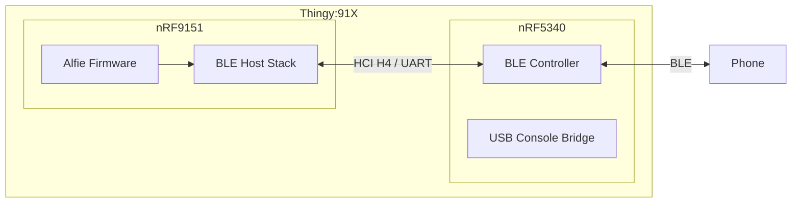
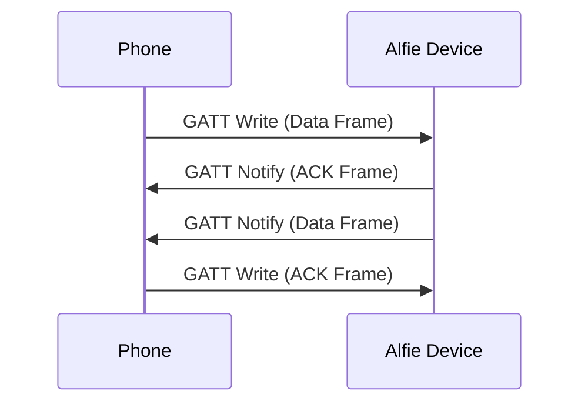

# Alfie Project (Part 4): BLE Transport Layer

## Overview

In Part 3, we built the DECT transport layer — fragmentation, reassembly, and reliable delivery over the air between two Alfie devices.  That covers the downstream side of Alfie's architecture.  But we still need a way for a phone to talk to the Alfie device in the first place.

That's where BLE comes in.  BLE is our upstream transport — the link between a phone and the Alfie device.  A lot of the heavy lifting was already done in Part 3 with the transport buffer, the `alfie_transport_t` abstraction, and the stop-and-wait ARQ pattern.  This article builds on all of that, so if you haven't read Part 3, I'd recommend starting there.

## The Hardware

The Thingy:91X has two main processors — the nRF9151 and the nRF5340.  The nRF9151 handles DECT (and LTE, though we're not using that).  The nRF5340 handles BLE.

But it's not quite as simple as "nRF5340 does BLE."  In our setup, the nRF5340 acts purely as a BLE controller — it handles the radio and the link layer, but that's it.  The nRF9151 runs the full BLE host stack: GATT server, connection management, all the application-level BLE logic.  The two chips communicate over UART using the HCI H4 protocol.



Why split it this way?  The nRF9151 is where all of our application logic lives — the DECT transport, the BLE transport, the router, everything.  By running the BLE host stack on the nRF9151 alongside everything else, we avoid having to shuttle application data between two processors.  The nRF5340 just handles the radio and gets out of the way.

As a bonus, the nRF5340 also runs a USB CDC bridge that forwards the nRF9151's UART console over USB.  This is how we access the shell for the demos in this series.

## The GATT Service

If you haven't worked with BLE before, the quick version is this: GATT (Generic Attribute Profile) is how BLE devices expose data and functionality.  A GATT server (our Alfie device) defines one or more services, each containing one or more characteristics.  A client (the phone) can read, write, or subscribe to notifications on those characteristics.

### The Alfie Service

Our Alfie GATT service is about as simple as it gets — one service with one data characteristic.

| | UUID |
|---|---|
| **Alfie Service** | `c1534fa3-5211-4e32-a176-d1af04513305` |
| **Data Characteristic** | `c1534fa4-5211-4e32-a176-d1af04513305` |

The data characteristic has two properties:

- **WRITE** — The phone sends data frames and ACK frames to the device by writing to this characteristic.
- **NOTIFY** — The device sends data frames and ACK frames to the phone via notifications on this same characteristic.

Both directions go through the same characteristic.  The phone writes, the device notifies.  The frame's `frame_type` field tells the receiver what it's looking at, just like on the DECT side.



### The Control Service

There's also a separate control service that exposes the device's 32-bit ID as a readable characteristic.  This is how a phone app would discover which Alfie device it's connected to.

| | UUID |
|---|---|
| **Control Service** | `7928884e-01e6-4137-86d3-adefd8afe21d` |
| **Device ID Characteristic** | `7928884f-01e6-4137-86d3-adefd8afe21d` |

## The BLE Transport Protocol

### Frame Format

If you read Part 3, this is going to look very familiar.  The BLE transport uses the same two frame types — DATA and DATA_ACK — with the same 8-byte header structure:

```c
typedef struct alfie_ble_service_proto_data_frame_t {
    alfie_ble_service_proto_frame_header_t header;  // version + frame_type (2 bytes)
    uint16_t seq_id;
    uint16_t total_size_bytes;
    uint8_t frag_idx;
    uint8_t frag_total;
    uint8_t payload[];
} __attribute__((__packed__)) alfie_ble_service_proto_data_frame_t;

typedef struct alfie_ble_service_proto_data_ack_frame_t {
    alfie_ble_service_proto_frame_header_t header;
    uint16_t seq_id;
    uint8_t frag_idx;
} __attribute__((__packed__)) alfie_ble_service_proto_data_ack_frame_t;
```

Same fields, same sizes, same stop-and-wait ARQ.

### The MTU Difference

The big difference between the BLE and DECT transports is how much data we can fit in a single fragment.

On the DECT side, we had 22 bytes of link layer payload and an 8-byte transport header, leaving us with 14 bytes per fragment.  On the BLE side, we configure an L2CAP TX MTU of 251 bytes.  After the 8-byte transport header, that gives us **243 bytes per fragment**.

That's a massive difference.  A 512-byte message that would need 37 fragments over DECT only needs 3 over BLE.

### Simplifications Over DECT

BLE is inherently point-to-point — there's one phone connected to one Alfie device.  This simplifies a few things compared to the DECT transport:

- **`dst_id` is ignored.**  On the DECT side, we need to specify which device we're sending to.  Over BLE, there's only one peer, so the write function accepts a `dst_id` for API compatibility but doesn't use it.
- **No `src_id` tracking.**  On the DECT side, we extended the transport buffer with a `src_id` field and a custom query callback to keep fragments from different senders separate.  Over BLE, there's only one sender (the phone), so the base `transport_buffer_t` is used directly with no extension and no additional query callback.

Everything else — the transport buffer pool, the reassembly logic, the ACK/retry mechanism — is identical.  Same 4 RX buffers, same 512-byte max message size, same 10-second timeout, same 4 retry attempts with a 2500 ms ACK timeout.

The work we put into making the transport buffer generic in Part 3 pays off.

> "Work smarter, not harder." — Everyone's grandpa

## Implementation

Alright, let's look at some code and get ready for some déjà vu.

### GATT Declaration

The Zephyr BLE stack lets us declaratively define our GATT service:

```c
BT_GATT_SERVICE_DEFINE(prv_alfie_ble_service,
    BT_GATT_PRIMARY_SERVICE(ALFIE_BLE_SERVICE_UUID),
    BT_GATT_CHARACTERISTIC(ALFIE_BLE_SERVICE_DATA_CHAR_UUID,
                           BT_GATT_CHRC_WRITE | BT_GATT_CHRC_NOTIFY,
                           BT_GATT_PERM_WRITE,
                           NULL,               // no read callback
                           prv_on_data_write,   // write callback
                           NULL),               // no initial value
    BT_GATT_CCC(prv_on_data_char_config_changed,
                BT_GATT_PERM_READ | BT_GATT_PERM_WRITE));
```

This gives us our service with one characteristic that supports write and notify.  The `prv_on_data_write` callback is what fires when the phone writes a frame to us.  The CCC (Client Characteristic Configuration) descriptor is what the phone uses to subscribe to notifications.

### Connection Management

BLE requires us to track the active connection so we can send notifications.  We register connect/disconnect callbacks and hold a reference to the connection:

```c
static void prv_device_connected(struct bt_conn *conn, uint8_t err)
{
    if (err != 0) {
        return;
    }

    prv_inst.conn = bt_conn_ref(conn);
}

static void prv_device_disconnected(struct bt_conn *conn, uint8_t reason)
{
    bt_conn_unref(conn);
    prv_inst.conn = NULL;
}
```

`bt_conn_ref` increments the connection's reference count so it doesn't get freed out from under us.  On disconnect, we release it.

### TX Path

The write function follows the same pattern as the DECT transport — fragment, send, wait for ACK — but instead of handing frames to the link layer, we send them as GATT notifications:

```c
int alfie_ble_service_write(const uint32_t dst_id, const void *data, size_t len_bytes)
{
    ...

    (void)dst_id;

    uint8_t buffer[ALFIE_BLE_SERVICE_PROTO_MAX_DATA_FRAME_PAYLOAD_SIZE_BYTES
                   + sizeof(alfie_ble_service_proto_data_frame_t)] = {0};

    alfie_ble_service_proto_data_frame_t *frame =
        (alfie_ble_service_proto_data_frame_t *)buffer;

    uint8_t frag_total = (len_bytes + ALFIE_BLE_SERVICE_PROTO_MAX_DATA_FRAME_PAYLOAD_SIZE_BYTES - 1)
                         / ALFIE_BLE_SERVICE_PROTO_MAX_DATA_FRAME_PAYLOAD_SIZE_BYTES;

    frame->header.version = 0;
    frame->header.frame_type = ALFIE_BLE_SERVICE_PROTO_FRAME_TYPE_DATA;
    frame->seq_id = sys_rand16_get();
    frame->frag_total = frag_total;
    frame->total_size_bytes = len_bytes;

    for (uint8_t i = 0; i < frag_total; i++) {
        frame->frag_idx = i;

        size_t payload_size_bytes = MIN(
            (len_bytes - (ALFIE_BLE_SERVICE_PROTO_MAX_DATA_FRAME_PAYLOAD_SIZE_BYTES * i)),
            ALFIE_BLE_SERVICE_PROTO_MAX_DATA_FRAME_PAYLOAD_SIZE_BYTES);

        memcpy(frame->payload,
               &((uint8_t *)data)[i * ALFIE_BLE_SERVICE_PROTO_MAX_DATA_FRAME_PAYLOAD_SIZE_BYTES],
               payload_size_bytes);

        int ret = prv_write_data_frame(frame,
            sizeof(alfie_ble_service_proto_data_frame_t) + payload_size_bytes);
        if (ret != 0) {
            return ret;
        }
    }

    return 0;
}
```

You can see the `(void)dst_id` right at the top — acknowledging the parameter exists for API compatibility but not using it.

The retry logic in `prv_write_data_frame` is identical to the DECT side, just swapping `dect_link_layer_write` for `bt_gatt_notify`:

```c
static int prv_write_data_frame(const alfie_ble_service_proto_data_frame_t *frame,
                                const size_t len_bytes)
{
    int ret = 0;

    for (uint8_t i = 0; i < ALFIE_BLE_SERVICE_TX_ATTEMPTS; i++) {
        k_sem_reset(&prv_inst.ack_sem);

        ret = bt_gatt_notify(prv_inst.conn,
            &attr_prv_alfie_ble_service[ALFIE_BLE_SERVICE_GATT_ATTR_DATA],
            frame, len_bytes);

        if (ret != 0) {
            return ret;
        }

        ret = k_sem_take(&prv_inst.ack_sem, K_MSEC(ALFIE_BLE_SERVICE_ACK_TIMEOUT_MS));
        if (ret == 0) {
            return 0;
        }
    }

    return ret;
}
```

### RX Path

When the phone writes to our data characteristic, the GATT write callback dispatches by frame type — same pattern as the DECT transport:

```c
static ssize_t prv_on_data_write(struct bt_conn *conn,
                                  const struct bt_gatt_attr *attr,
                                  const void *buf, uint16_t len,
                                  uint16_t offset, uint8_t flags)
{
    ...

    alfie_ble_service_proto_frame_header_t *header =
        (alfie_ble_service_proto_frame_header_t *)buf;

    switch (header->frame_type) {
        case ALFIE_BLE_SERVICE_PROTO_FRAME_TYPE_DATA:
            prv_handle_incoming_data_frame(header, len);
            break;
        case ALFIE_BLE_SERVICE_PROTO_FRAME_TYPE_DATA_ACK:
            prv_handle_incoming_data_ack(header, len);
            break;
        ...
    }

    return len;
}
```

The data frame handler uses the transport buffer for reassembly.  Notice the `NULL` passed as the last argument to `transport_buffer_pool_get` — no additional query callback needed:

```c
static void prv_handle_incoming_data_frame(
    const alfie_ble_service_proto_frame_header_t *header,
    const size_t len_bytes)
{
    const alfie_ble_service_proto_data_frame_t *frame =
        (alfie_ble_service_proto_data_frame_t *)header;

    ...

    transport_buffer_t *buffer = transport_buffer_pool_get(
        &prv_inst.rx_pool, frame->seq_id, frame->total_size_bytes,
        frame->frag_idx, frame->frag_total, NULL);

    if (buffer == NULL) {
        return;
    }

    transport_buffer_write_ret_t ret = transport_buffer_write(
        buffer, frame->frag_idx, frame->payload,
        len_bytes - sizeof(alfie_ble_service_proto_data_frame_t));

    switch (ret) {
        case TRANSPORT_BUFFER_WRITE_RET_SUCCESS:
        case TRANSPORT_BUFFER_WRITE_RET_DUPLICATE:
            prv_write_data_ack(frame);
            break;
        case TRANSPORT_BUFFER_WRITE_RET_COMPLETE:
            prv_write_data_ack(frame);
            prv_handle_complete_incoming_data_transaction(buffer);
            break;
        ...
    }
}
```

If you compare this side-by-side with the DECT transport's `prv_handle_data_frame` from Part 3, the structure is nearly line-for-line identical.  The only differences are the absence of `src_id` tracking and the `NULL` where the DECT transport would pass `&src_id`.

## Demo Time!

For the demo, I wrote a quick Python BLE client using [Bleak](https://github.com/hbldh/bleak) that implements the same transport protocol as the firmware — same frame format, same fragmentation, same stop-and-wait ARQ.  It connects to the Alfie device, subscribes to notifications on the data characteristic, and can send and receive messages.  It also adapts its fragment size to the negotiated BLE MTU, so it works regardless of what the connection settles on.

First, I boot up the python app and scan for devices.  We see our Alfie device and are able to connect to it:


_Python BLE client connecting to the Alfie device_

You'll note that the client is able to pick up the device ID using the control service.

Now we attempt to send a message from BLE to the Alfie device:


_Sending a Message Over BLE From the Python Client_

You can see the message is received and logged to the UART console from the Alfie device:


_Message from BLE client appearing on Alfie device_

The payload size was 323 bytes, which shows that the fragmentation and reassembly is working.

Finally, we reply from the Alfie device, simulating receiving a message over DECT and forwarding to the BLE transport layer:


_Replying from Alfie device over BLE_

And the reply is seen in the BLE client:


_Response from Alfie device appearing in Python client_

## Conclusion

And with that, we've got both sides of the Alfie device covered — DECT for device-to-device communication and BLE for phone-to-device communication.  Both transports use the same fragmentation and reassembly pattern, the same stop-and-wait ARQ, and the same transport buffer infrastructure.  The BLE side just happens to be a lot simpler thanks to its point-to-point nature and larger MTU.

There are some rough edges on the BLE side, though.  There's no pairing, so any device in range can connect and start sending data.  We also don't advertise the Alfie service UUID, so a client has no way to discover that it's an Alfie device without already knowing the address.  These are things that will need to be addressed, but for now, they don't block us from moving forward.

Next up, we'll tie everything together with the Alfie router and protocol — the layer that sits on top of both transports and actually routes messages between phones and devices across the network.

The firmware for this project can be found on [GitHub](https://github.com/evanstoddard/alfie_firmware).
