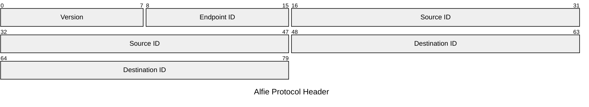
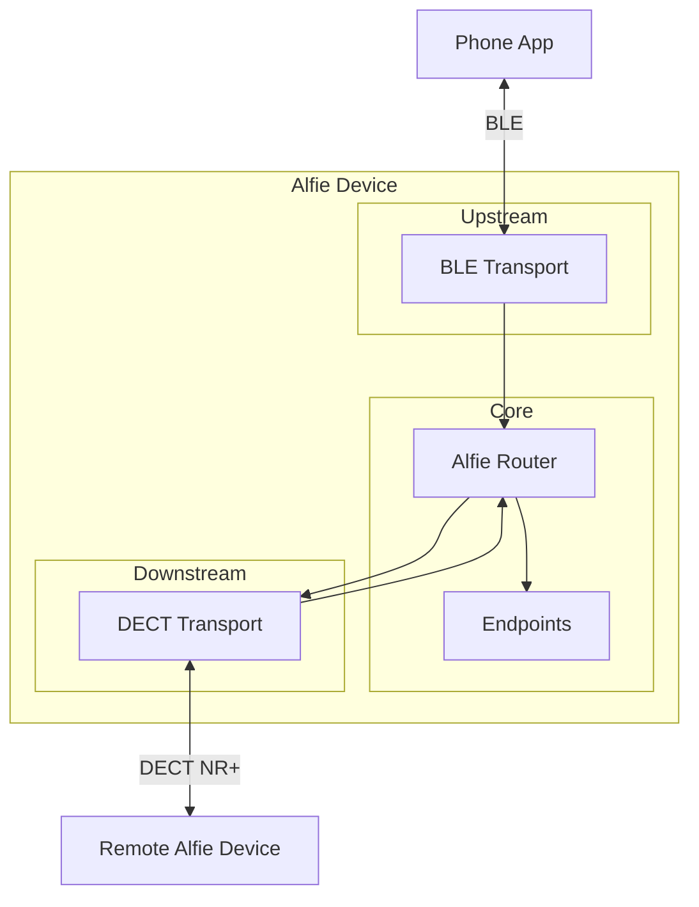
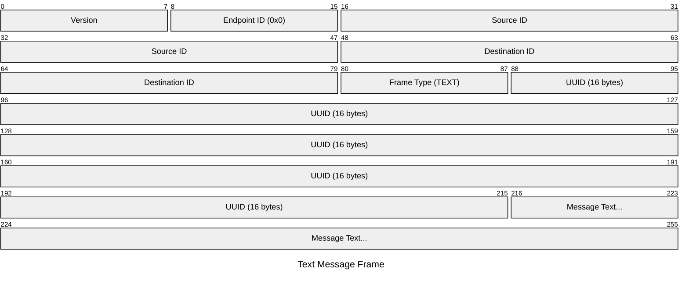

# Alfie Project (Part 5): The Alfie Router and Protocol

## Overview

In Parts 3 and 4, we built two transport layers — DECT for device-to-device communication and BLE for phone-to-device communication.  Both can fragment, reassemble, and reliably deliver messages.  But right now, they don't know about each other.

That's where the Alfie router and protocol come in.  The router sits between the transports and moves messages from one side to the other — BLE in, DECT out, and vice versa.  The Alfie protocol defines the header format that tells the router where a message is going and what should handle it when it gets there.

## The Alfie Protocol

The Alfie protocol is the application-layer format that sits on top of the transport layer.  Every message that flows through the system — whether it came in over BLE or DECT — starts with the same 10-byte header:

```c
typedef struct alfie_proto_header_t {
    uint8_t version;
    uint8_t endpoint_id;
    uint32_t src_id;
    uint32_t dst_id;
} __attribute__((__packed__)) alfie_proto_header_t;
```



- **Version** — Same idea as the transport and link layer version fields.  Future-proofing in case the header format needs to change.
- **Endpoint ID** — This is the routing key.  It tells the system which handler should process this message.  Think of it like a port number in TCP — different endpoint IDs map to different functionality.
- **Source ID** and **Destination ID** — The 32-bit device IDs we've been using since Part 2.  The source is who sent the message, the destination is who it's for.

The protocol header doesn't carry any payload itself.  The actual payload (a text message, for example) comes right after the header, and its format is defined by whichever endpoint handles that `endpoint_id`.

## The Alfie Router

The router is the glue that holds everything together.  Messages come in from one transport, get forwarded out the other, and get dispatched to the appropriate endpoint along the way.



The router maintains two linked lists — one for registered transports and one for registered endpoints.  It runs its own dedicated thread and uses two Zephyr FIFOs to queue incoming messages: one for messages arriving from upstream transports and one for messages arriving from downstream transports.

### Transport Registration

Transports register with the router at initialization.  When a transport registers, the router calls the transport's `register_rx_cb` function to wire up a callback.  From that point on, whenever the transport finishes reassembling a complete message, it calls that callback, which queues the message into the appropriate FIFO based on the transport's type (upstream or downstream).

```c
int alfie_router_register_transport(alfie_transport_t *transport)
{
    ...

    int ret = transport->api->register_rx_cb(prv_handle_transport_rx);
    if (ret != 0) {
        return ret;
    }

    sys_slist_append(&prv_inst.transports, &transport->node);

    return 0;
}
```

The RX callback takes a reference on the buffer and throws it in the right FIFO:

```c
static void prv_handle_transport_rx(alfie_transport_t *transport, transport_buffer_t *buffer)
{
    if (buffer->total_size_bytes < sizeof(alfie_proto_header_t)) {
        return;
    }

    transport_buffer_ref(buffer);

    switch (transport->type) {
        case ALFIE_TRANSPORT_TYPE_UPSTREAM:
            k_fifo_put(&prv_inst.from_upstream_fifo, buffer);
            break;
        case ALFIE_TRANSPORT_TYPE_DOWNSTREAM:
            k_fifo_put(&prv_inst.from_downstream_fifo, buffer);
            break;
    }
}
```

### Message Routing

The router thread uses `k_poll` to wait on both FIFOs.  When a message arrives in either FIFO, it wakes up and routes it:

```c
static void prv_thread(void *arg1, void *arg2, void *arg3)
{
    struct k_poll_event events[2] = {
        K_POLL_EVENT_INITIALIZER(K_POLL_TYPE_FIFO_DATA_AVAILABLE,
            K_POLL_MODE_NOTIFY_ONLY, &prv_inst.from_upstream_fifo),
        K_POLL_EVENT_INITIALIZER(K_POLL_TYPE_FIFO_DATA_AVAILABLE,
            K_POLL_MODE_NOTIFY_ONLY, &prv_inst.from_downstream_fifo),
    };

    while (true) {
        k_poll(events, ARRAY_SIZE(events), K_FOREVER);

        if (events[0].state == K_POLL_STATE_FIFO_DATA_AVAILABLE) {
            events[0].state = K_POLL_STATE_NOT_READY;
            transport_buffer_t *buffer =
                k_fifo_get(&prv_inst.from_upstream_fifo, K_NO_WAIT);
            if (buffer != NULL) {
                prv_forward_to_downstream(buffer);
            }
        }

        if (events[1].state == K_POLL_STATE_FIFO_DATA_AVAILABLE) {
            events[1].state = K_POLL_STATE_NOT_READY;
            transport_buffer_t *buffer =
                k_fifo_get(&prv_inst.from_downstream_fifo, K_NO_WAIT);
            if (buffer != NULL) {
                prv_forward_to_upstream(buffer);
            }
        }
    }
}
```

Both forwarding functions look pretty much the same.  Here's the upstream-to-downstream path:

```c
static void prv_forward_to_downstream(transport_buffer_t *buffer)
{
    alfie_proto_header_t *header = (alfie_proto_header_t *)buffer->buffer->data;

    sys_snode_t *node;
    SYS_SLIST_FOR_EACH_NODE(&prv_inst.transports, node) {
        alfie_transport_t *transport = (alfie_transport_t *)node;
        if (transport->type == ALFIE_TRANSPORT_TYPE_DOWNSTREAM) {
            transport->api->write(header->dst_id, buffer->buffer->data,
                                  buffer->total_size_bytes);
        }
    }

    prv_notify_endpoint(header, buffer);

    transport_buffer_unref(buffer);
}
```

Walk through all the registered transports, find the downstream ones, and call `write()` on each.  Then notify the matching endpoint and release the buffer reference.  The downstream-to-upstream path does the same thing in the other direction.

## Endpoints

The router handles moving messages between transports, but it doesn't know or care what's inside them.  That's the job of endpoints.

An endpoint is a handler for a specific type of functionality, identified by its `endpoint_id`.  Right now, we only have one — the messaging endpoint for text messages.  But the system is designed so that new endpoints can be added without touching the router.  A push-to-talk endpoint, a file transfer endpoint, a generic data endpoint — they'd all just register with a different `endpoint_id` and provide their own `on_frame_rx` callback.

```c
typedef struct alfie_endpoint_api_t {
    void (*on_frame_rx)(transport_buffer_t *buffer);
} alfie_endpoint_api_t;

typedef struct alfie_endpoint_t {
    sys_snode_t node;
    alfie_endpoint_api_t api;
    uint8_t endpoint_id;
} alfie_endpoint_t;
```

Endpoints register with the router the same way transports do — they get appended to a linked list.  When the router forwards a message, it reads the `endpoint_id` from the Alfie protocol header and searches for a matching endpoint:

```c
static void prv_notify_endpoint(const alfie_proto_header_t *header,
                                transport_buffer_t *buffer)
{
    sys_snode_t *node;
    SYS_SLIST_FOR_EACH_NODE(&prv_inst.endpoints, node) {
        alfie_endpoint_t *endpoint = (alfie_endpoint_t *)node;
        if (endpoint->endpoint_id == header->endpoint_id) {
            endpoint->api.on_frame_rx(buffer);
            return;
        }
    }
}
```

If a match is found, the endpoint's callback is called with the transport buffer.  If no match is found, the message is silently dropped.

The linear search through a linked list is definitely not ideal — it's O(n) for every message.  With only one endpoint right now it doesn't matter, but as the number of endpoints and the amount of traffic grows, replacing the list with a lookup table for O(1) dispatch would be a worthwhile improvement.

## The Messaging Endpoint

The messaging endpoint is the first concrete endpoint in the system, registered at endpoint ID `0x0`.  This is what actually handles text messages.

### The Message Format

The messaging endpoint adds its own header on top of the Alfie protocol header — just a single `frame_type` byte:

```c
typedef struct alfie_messaging_proto_header_t {
    alfie_proto_header_t alfie_header;
    uint8_t frame_type;
} __attribute__((__packed__)) alfie_messaging_proto_header_t;
```

Right now, the only frame type is `TEXT`.  For a text message, the frame looks like this:

```c
typedef struct alfie_messaging_proto_text_frame_t {
    alfie_messaging_proto_header_t header;
    uint8_t uuid[ALFIE_MESSAGE_UUID_SIZE_BYTES];
    char message[];
} __attribute__((__packed__)) alfie_messaging_proto_text_frame_t;
```



The 16-byte UUID is there for message deduplication and tracking.  Each message gets a unique UUID so that even if the same text is sent twice, the system can tell them apart.

### The Handler

The endpoint registers itself with the router at init:

```c
int alfie_messaging_endpoint_init(void)
{
    prv_inst.endpoint.endpoint_id = ALFIE_MESSAGING_ENDPOINT_ENDPOINT_ID;
    prv_inst.endpoint.api.on_frame_rx = prv_handle_incoming_frame;

    alfie_router_register_endpoint(&prv_inst.endpoint);

    prv_inst.initialized = true;
    return 0;
}
```

When a message comes in, we check the frame type and dispatch accordingly:

```c
static void prv_handle_incoming_frame(transport_buffer_t *buffer)
{
    if (buffer->total_size_bytes < sizeof(alfie_messaging_proto_header_t)) {
        return;
    }

    alfie_messaging_proto_header_t *header =
        (alfie_messaging_proto_header_t *)buffer->buffer->data;

    switch (header->frame_type) {
        case ALFIE_MESSAGING_PROTO_FRAME_TYPE_TEXT:
            prv_handle_text_frame(header, buffer->total_size_bytes);
            break;
        default:
            break;
    }
}
```

The text handler itself is pretty bare bones right now:

```c
static void prv_handle_text_frame(const alfie_messaging_proto_header_t *header,
                                  size_t len_bytes)
{
    alfie_messaging_proto_text_frame_t *frame =
        (alfie_messaging_proto_text_frame_t *)header;

    size_t msg_len = len_bytes - sizeof(alfie_messaging_proto_text_frame_t);

    LOG_INF("Handling text frame:\r\n"
            "\tSrc ID: 0x%08X\r\n"
            "\tDst ID: 0x%08X\r\n"
            "\tMessage: %.*s",
            frame->header.alfie_header.src_id,
            frame->header.alfie_header.dst_id,
            msg_len,
            frame->message);
}
```

Right now, the handler just logs the message.  In the future, this is where you'd hook in delivery callbacks or message persistence.

## Demo Time!

This is the one we've been building toward.  Two Thingy:91Xs, an iPad, an iPhone, and airplane mode on both.  No cell service, no WiFi — just BLE and DECT NR+.

<video width="800" autoplay loop muted playsinline>
  <source src="/assets/images/26_03_01_alfie_part_5/e2e_demo.mp4" type="video/mp4">
</video>
_Two Alfie Devices Texting Each Other Over BLE and DECT NR+_

## Conclusion

And with that, the router and protocol tie the two transports together.  Messages flow from BLE to DECT and back, and the endpoint system gives us a clean way to add new functionality down the road.

There are still rough edges — the MAC layer needs real scheduling, the TX paths are synchronous and blocking, and there's no pairing or encryption.  But the layers are cleanly separated, so each piece can be improved without tearing everything apart.

That wraps up the first stint of the series.

This has been a really fun project to work on, and I'm excited to see and share all the improvements planned.  While I don't expect Alfie to take off the same way as Meshtastic did, I think DECT NR+ is a super important development in low-power wireless communications.  If you have any cool ideas or improvements to the existing codebase, feel free to reach out or submit a PR.  At the very least, keep me accountable to continue working on this project as I think it is a great way to hone my craft and learn even more about DECT.

Stay tuned, many more follow-ups to come.

The firmware for this project can be found on [GitHub](https://github.com/evanstoddard/alfie_firmware).
