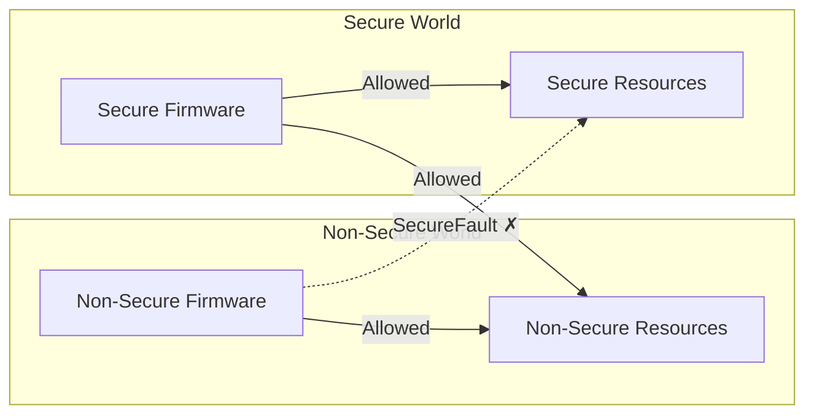

# TrustZone Demystified 

I have a confession... Up until this point, I didn't have a great understanding how TrustZone worked.  

<iframe src="https://giphy.com/embed/ai8mZLRcUObUk" width="480" height="192" style="" frameBorder="0" class="giphy-embed" allowFullScreen></iframe><p><a href="https://giphy.com/gifs/images-fighters-foo-ai8mZLRcUObUk">via GIPHY</a></p>

Here's where my understanding was at:

1. It allowed firmware to be separated into a "Secure" and "Non-Secure" realm
2. It was what allowed TF-M to work
3. There was some sort of connection between mbedTLS+PSA and TrustZone (via TF-M?)
4. When all of the above was configured, I'd get SecureFaults and hardware would fly across the room.

As a firmware engineer in the IoT space, this lack of foundational understanding seemed like a serious problem.

Now, the saving grace in all of this, was Zephyr.  I am a **HUGE** fan of Zephyr.  With a couple Kconfig options, I had a safety blanket because pretty much everything required for secure firmware was set up automatically.  But, with that, I became complacent.  Debugging SecureFaults were hard, because I didn't really understand what was happening with my firmware.  I didn't have a lot of confidence talking with a client's security team.  I didn't have a great understanding around all the attack vectors that could be exploited.

So, I set out to better understand TrustZone, and how it plays into ensuring firmware is secure.

# What is TrustZone

If you've used Linux, you've seen this idea before: kernel space vs. user space, where user code can't touch hardware directly and must go through system calls. TrustZone is the same concept applied to microcontrollers.

TrustZone for microcontrollers was introduced with the ARMv8-M architecture, found in cores like the Cortex-M23 and Cortex-M33. At a high level, it is a way to mark some resources of an MCU as accessible only by "secure" firmware.  Essentially, you have two firmware images, one marked "secure" and the other marked "non-secure."  Any resources marked accessible only by secure firmware can only be interacted with directly by the secure image.  If the non-secure image attempts to access it, a security fault will be raised.  If the non-secure firmware image needs to interact with memory or a secure peripheral, it must do so, indirectly, through a series of entrypoints defined and implemented by the secure firmware.  These entrypoints are known as **Non-Secure Callable (NSC) functions**, special functions marked by the secure image that the non-secure image is permitted to call, acting as a controlled gateway into the secure world.



## Why is this Important?

Consider something like a robotic lawnmower.  There needs to be firmware that can engage and disengage the mower blades.  Things can go horribly wrong if those blades spin up when they shouldn't.

There might be a couple key safety checks that must be satisfied before the blades can be turned on.  For instance, the mower must be flat on the ground.  There could be a maintenance door that must be closed.  The battery temperature must not exceed some limit.

But there is also human interaction.  So maybe, from an app, a user can tap "start mowing", which ultimately would call some function "engage blades."

The work flow could look something like this:

1. User taps "start mowing."
2. Mower firmware checks accelerometer indicating that the mower is on the ground
3. Mower firmware checks GPIO pin indicating that the maintenance door is closed
4. Mower firmware checks battery temperature indicating that it is not overheating
5. Mower sets GPIO pin engaging the blades.

Seems all fine and dandy.  But what if there's a bug in the firmware during any of the steps leading up to step 5?  Maybe there's a stack overflow, and it just so happens to write the address that sets the GPIO pin that engages the blades?  That wouldn't be good.

Or, assuming this is an internet connected device, what if some adversary figures out a way to call the "engage blades" function, bypassing all the safety checks.  Again, not good.

So how could something like TrustZone help with this?

The first step, would be to mark the peripherals dealing with the safety checks, and the blade engagement as "Secure" peripherals.  So any interaction with the accelerometer, GPIO inputs for interlock switches, temperature sensors, and GPIO output for the blade can only be directly read or written to by firmware executed in "Secure" mode.

Then, any user interaction, like an engage button or callback from TCP socket when the user presses "start" on their phone, is implemented in "Non secure" firmware.  Now, if the non-secure firmware tries to write or read directly from the address space associated with those secure peripherals, a security fault handler will get called.

If you've worked with IoT firmware, a more relevant use case would be dealing with private keys and certificates.  The last thing you want is to leak all your juicy secrets.  You've probably heard of mbedTLS+PSA. There are a wealth of ARM-based MCUs with cryptocells that enable secure storage of keys and fast crypto operations.  Here's where TrustZone, TF-M, and PSA all come together: TF-M runs inside the secure partition and implements the PSA Crypto API there.  mbedTLS, running on the non-secure side, is configured to dispatch all crypto operations to TF-M via PSA calls rather than handling them directly.  The result is that private keys never leave the secure world, and the non-secure firmware never has direct access to them.

# Let's See it in Action!

What better way to kick this off than with a simple "Hello World!"

Our target hardware is an STM32H563-based nucleo devkit.  This features an M33 MCU with TrustZone.

## Hello World!

Before we start, let's put together a simple "Hello World" image.

Using CubeMX, we configured a bare minimal project with TrustZone disabled and UART3 enabled.

Our application code looks like the following:

```c
/*****************************************************************************
 * Bindings
 *****************************************************************************/

/**
 * @brief Binding for stdio
 *
 * @param ch Character to write
 * @return Returns 0 on success
 */
int __io_putchar(int ch) {
  HAL_UART_Transmit(&huart3, (const uint8_t *)&ch, sizeof(uint8_t), 1000);

  return 0;
}

/*****************************************************************************
 * Functions
 *****************************************************************************/

void app_entry(void) {
  while (1) {
    printf("Hello World!\r\n");
    HAL_Delay(1000);
  }
}
```

It's fairly simple.  The entry point simply runs a while loop in which it prints "Hello World!" every second.

The `__io_putchar` function is what gets the output of printf to our UART.  We simply transmit each character one by one.

Now, taking a look at the UART terminal, we successfully see our output:

```
[18:51:55.097] Connected to /dev/ttyACM0
[18:51:55.719] Hello World!
[18:51:56.721] Hello World!
[18:51:57.723] Hello World!
[18:51:58.725] Hello World!
[18:51:59.727] Hello World!
[18:52:00.729] Hello World!
[18:52:01.731] Hello World!
[18:52:02.733] Hello World!
[18:52:03.735] Hello World!
[18:52:04.737] Hello World!
[18:52:05.739] Hello World!
[18:52:06.741] Hello World!
[18:52:07.743] Hello World!
[18:52:08.745] Hello World!
```

## Integrating TrustZone

Now, let's integrate TrustZone into this simple demo. 

I've created a new project with TrustZone enabled and I've configured UART3 to be initialized in the secure environment.


_UART3 configured as a secure peripheral._

### TrustZone Project Structure

Let's take a quick look at the project structure.


_TrustZone project structure._

You can see that there are Secure and NonSecure firmware targets as well as a Secure_nsclib target.

The Secure and NonSecure targets are as they seem at face value.  The secure target is where all the MCU configuration, including the secure peripherals, happens.  Additionally, any functionality that should be secure only is implemented in this target.

The NonSecure is where a majority of the firmware for a project would live. For instance, all the business logic and user interaction for a secure project would be implemented here.

The Secure_nsclib is a static library that gets linked to the NonSecure image.  Any interaction that needs to happen between the Secure and NonSecure images happens through veneers that are compiled into this static library.  For instance, any callable functions that the secure image wants to expose to the NonSecure image get a veneer.  We'll dive deeper into what this veneer looks like later.

### Initial TrustZone Firmware

We can copy over the application code from our original firmware project.  However, we need to remove the `#include` to `usart.h` and clear out the body of `__io_putchar`, since UART3 is not enabled in the NS firmware.  We also, might as well update our "Hello World" string.

```c
/*****************************************************************************
 * Bindings
 *****************************************************************************/

/**
 * @brief Binding for stdio
 *
 * @param ch Character to write
 * @return Returns 0 on success
 */
int __io_putchar(int ch) { return 0; }

/*****************************************************************************
 * Functions
 *****************************************************************************/

void app_entry(void) {
  while (1) {
    printf("Hello from NS World!\r\n");
    HAL_Delay(1000);
  }
}
```

In the secure firmware, we can copy over the original `__io_putchar` implementation, since UART3 is enabled in the secure firmware.

If we take a quick look at the `main.c` file of the Secure firmware, we see a call to `NonSecure_Init()`.  This is what actually starts the NonSecure firmware image.


```c
int main(void) {
  /*
   * Board bring up.
   */
  ...

  /*************** Setup and jump to non-secure *******************************/

  NonSecure_Init();

  /* Non-secure software does not return, this code is not executed */
}
```

With TrustZone enabled, the Secure image always runs first.  That call will not return (or at least shouldn't).  In a way, you can think of the secure firmware image as a series of interrupt handlers.  The secure image (normally), does not sit in a `while(1)` like a normal bare-metal image, and you normally wouldn't run an RTOS inside the secure image either.  It is essentially a place where initial hardware initialization occurs and contains interrupt handlers for secure peripherals as well as functions that can be called by the NonSecure firmware.

To prove this out, we add a `printf` call before and after that `NonSecure_Init()` call:

```c
int main(void) {
  /*
   * Board bring up.
   */
  ...

  printf("Secure firmware successfully booted!\r\n");

  /*************** Setup and jump to non-secure *******************************/

  NonSecure_Init();

  /* Non-secure software does not return, this code is not executed */
  printf("Big yikes...\r\n");
}
```

Before we can flash this image, we need to set a couple option bytes that live in the MCUs flash.  The specifics will vary across different MCUs, but for the ST, we need to set an option byte to enable TrustZone, as well as set the watermarking so the MCU knows which portion of flash is designated as the Secure section, and which is designated as NonSecure.

First, we set the option byte to enable TrustZone:


_Enabling TrustZone._

Then, we need to mark the sections of flash that are Secure and NonSecure.  The STM32H563 board we're using has two flash banks, each 1 MB in size.  By default, the two images are linked such that the Secure image lives at the top of the first bank, and the NonSecure image lives at the top of the second.  The default option bytes, however, mark the entirety of both banks as Secure.  So if we enable TrustZone and flash the firmware, but don't update the watermark option bytes, the Secure firmware will trigger a SecureFault (which can escalate to a HardFault if unhandled) when executing 'NonSecure_Init()'.

This is something that tripped me up for a bit, and was a classic case of RTFM.  The ST reference manuals say to set the start sector to `0x1` and end sector as `0x0` to mark the entire bank as NonSecure.

We do that, and leave bank 1's watermarks alone since they're fine for now.


_Setting watermarks._

Now, flashing the firmware, we see the following on the UART log:

```
[20:23:49.726] Connected to /dev/ttyACM0
Secure firmware successfully booted!
```

So, the good news is we see the secure firmware booting, and we don't see "Big yikes..."

However, we don't see "Hello from NS World!" being printed.  This is understandable because we stubbed out the `__io_putchar` call on the NonSecure side.

Let's get the two images talking to each other.

### Implementing Secure Function Call Veneers

For those of you that want to understand what is happening at the instruction level of this portion, we'll talk about this in detail at the end of the article.  

But the high level break down is, for the NonSecure image to "call" a function implemented in the Secure image, that function needs to have a veneer created.

#### A Quick Metaphor

A somewhat flawed, but applicable analogy is defining some variable as static in a module's c file.  No other translation unit can directly access that variable by name.  However, it can be exposed by defining a public getter function.  Consider the c file for a module called `module_a`:

```c
static uint32_t prv_counter = 0;
```

Now say we have `module_b` that needs to get access to the value of `prv_counter`.  Module b can't directly call `printf("Counter value: %u\r\n", prv_counter);`.

So in the header file of `module_a` we can declare a public getter called `const uint32_t module_a_get_counter(void);` and implement it like such:

```c
const uint32_t module_a_get_counter(void) {
  return prv_counter;
}
```

And now, `module_b` can call `module_a_get_counter()` and get the value of the counter.  

This is kind of how it works with the interaction between the two images.  A function that is implemented in the Secure firmware that we want callable by the NonSecure firmware, needs to be publicly declared as callable.  A veneer is created, that when called by the NonSecure firmware, puts the MCU into a state that can access the Secure address space, execute the function, and then return to a NonSecure state.

So for our firmware, we need a callable function that allows us to put a character on the secure UART peripheral.

In `secure_nsc.h`, we declare the following function:

```c
int SECURE_put_char_uart(int ch);
```

Then, we define this in the secure firmare in `secure_nsc.c`:

```c
CMSE_NS_ENTRY int SECURE_put_char_uart(int ch) {
  return __io_putchar(ch);
}
```

You'll notice `CMSE_NS_ENTRY`.  This marks the function as callable from the NonSecure side.

Now, in the NonSecure firmware, where we originally had the body of `__io_putchar` directly write to the UART API, we replace that with `SECURE_put_char_uart`, which will bubble up through the linkage and call that UART API from the secure side. 

```c
/*****************************************************************************
 * Bindings
 *****************************************************************************/

/**
 * @brief Binding for stdio
 *
 * @param ch Character to write
 * @return Returns 0 on success
 */
int __io_putchar(int ch) {
  SECURE_put_char_uart(ch);
  return 0;
}

/*****************************************************************************
 * Functions
 *****************************************************************************/

void app_entry(void) {
  while (1) {
    printf("Hello from NS World!\r\n");
    HAL_Delay(1000);
  }
}
```

Flashing this firmware, we see the following in the UART console:

```
Secure firmware successfully booted!
Hello from NS World!
Hello from NS World!
Hello from NS World!
Hello from NS World!
Hello from NS World!
Hello from NS World!
Hello from NS World!
Hello from NS World!
```

And now our NonSecure firmware can interact with the Secure side!
